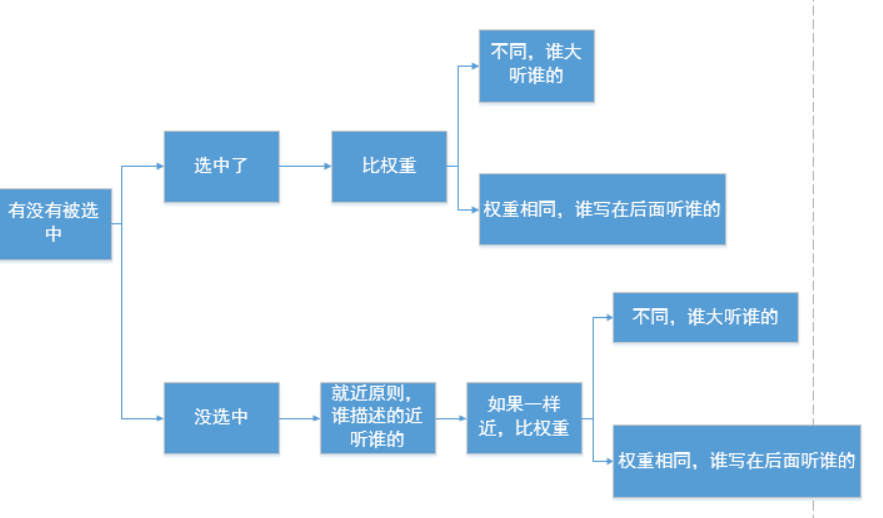

### 继承性

样式的继承：我们对一个元素设置的样式同时也会应用到它的后代元素上

可继承的属性：

```
1.字体系列属性
font:组合字体
font-family:规定元素的字体系列
font-weight:设置字体的粗细
font-size:设置字体的尺寸
font-style:定义字体的风格
font-variant:偏大或偏小的字体

2.文本系列属性
text-indent:文本缩进
text-align:文本水平对刘
line-height:行高
word-spacing:增加或减少单词间的空白
letter-spacing：增加或减少字符间的空白
text-transform:控制文本大小写
direction:规定文本的书写方向
color:文本颜色

3.元素可见性
visibility

4.表格布局属性
caption-side定位表格标题位置
border-collapse合并表格边框
border-spacing设置相邻单元格的边框间的距离
empty-cells单元格的边框的出现与消失
table-layout表格的宽度由什么决定<automatic.fixed.inherit>

5.列表布局属性
list-style-type文字前面的小点点样式
list-style-position小点点位置
list-style以上的属性可通过这属性集合

6.引用
quotes设置嵌套引用的引号类型

7.光标属性
cursor:箭头可以变成需要的形状
```

<br>

不可继承的属性：

```
1.display

2.文本属性
vertical-align:垂直文本对齐
text-decoration:规定添加到文本的装饰
text-shadow:文本阴影效果
white-space:空白符的处理

3.盒子模型属性
width、height、margin 、margin-top、margin-right、margin-bottom、margin-left、border、border-style、border-top-style、border-right-style、border-bottom-style、border-left-style、border-width、border-top-width、border-right-right、border-bottom-width、border-left-width、border-color、border-top-color、border-right-color、border-bottom-color、border-left-color、border-top、border-right、border-bottom、border-left、padding、padding-top、padding-right、padding-bottom、padding-left

4.背景属性
background、background-color、background-image、background-repeat、background-position、background-attachment

5.定位属性
float、clear、position、top、right、bottom、left、min-width、min-height、max-width、max-height、overflow、clip、z-index

6.h系列不能继承文字大小
  a标签不能继承文字颜色
```

<br>

### 层叠性

- CSS处理冲突的一种能力，这个我们称之为层叠性
- 同一个元素多次设置不同值的同一样式就会产生层叠性，比如：

```html
<style>
        
    p{
        color: palegoldenrod;
    }

    .p{
        color: pink;
    }

    #p{
        color: red;
    }
</style>

<p class="p" id="p">层叠性</p>
```
- 当发生层叠性时，哪个选择器设置的属性起作用，是由优先级来确定

<br>

### 优先级

多个选择器可能会选择同一个元素，优先级高的先做，优先级低的后做，这个我们称之为优先级

<br>

**优先级判断方式有哪些?**

1. 是否是直接选中（间接选中就是指继承，如果是间接选中时，就近原则）
2. 直接选中时是相同选择器（则谁写在后面就听谁的）
3. 直接选中时不是同选择器（则就会按照选择器的优先级来层叠）
4. **如果不能直接选中某个元素，通过继承性影响的话，那么权重是0**




<br>

<br>

<br>

### 选择器的优先级（权重）

选则器       |  权重    |
----        |   ----    |
内联样式（行内样式）     |  1 0 0 0 |
id选择器     |  0 1 0 0 |
类和伪类选择器  |  0 0 1 0 |
元素选择器   |   0 0 0 1    |
通配选择器   |   0 0 0 0    |
继承样式     |  没有优先级  |

<br>

1. 对于相同的选择器，其样式表排序：行级样式 > 内嵌样式表 > 外部样式表（就近原则）
2. 对于相同方式引入的样式表，其选择器排序：ID选择器 > 类选择器 > 标签选择器
3. 分组选择器（并级选择器）要分开计算取最大值


<br>

**!important：** 用于提升某个直接选中标签的选择器中的某个属性的优先级的, 可以将被指定的属性的优先级提升为最高

1. !important只能用于直接选中, 不能用于间接选中（继承）
2. !important只能提升被指定的属性的优先级, 其它的属性的优先级不会被提升


