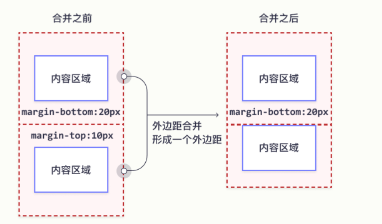
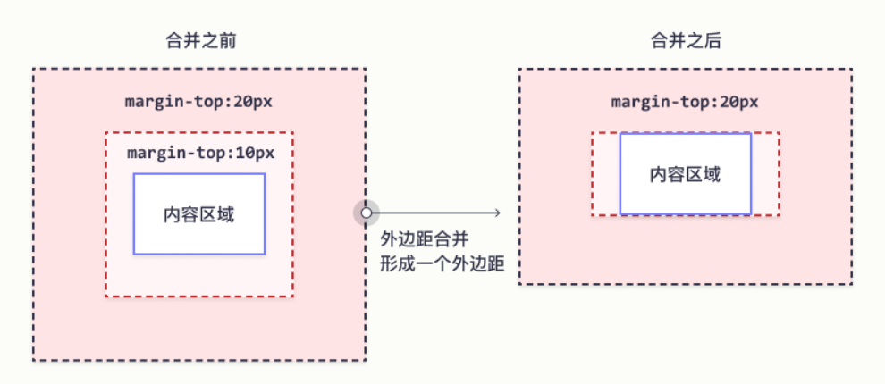

### 外边距合并

外边距合并指的是，当两个垂直外边距相遇时，它们将形成一个外边距。合并后的外边距的高度等于两个发生合并的外边距的高度中的较大者。

**垂直外边距重叠：**
相邻的垂直方向外边距会发生重叠现象

- 兄弟元素：相邻垂直外边距会取两者之间绝对值的最大值
- 父子元素：相邻外边距，子元素会传递给父元素
- 父子外边距的折叠会影响页面布局

 

**兄弟元素：**

 

 

 

**父子元素：**

 

 

 

### 解决方案

1. 加边框区分父子元素外边距，解决外边距塌陷
2. 为父盒子设置内边距解决外边距塌陷
3. 为父盒子设置overflow:hidden解决外边距塌陷
4. 设置BFC解决