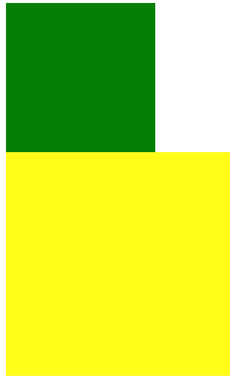

### 浮动基本介绍

通过浮动可以使元素向其父元素左侧或右侧移动

<br>

```float:```

-  参数：
   - none：默认值
   - left
   - right

1. 元素设置浮动以后，会从文档流中脱离，不占用文档流中的位置，导致下方元素自动向上，与元素一排
2. 浮动元素不会盖住其他的浮动元素，浮动元素向左或者右移动时，不会覆盖其他浮动元素
3. 行内元素脱离文档流后，变成块元素

<br>

<br>

### 清除浮动

clear 清除浮动元素对当前元素产生的影响

参数:

- left：   清除左侧浮动元素产生的影响，**左侧不允许浮动元素**
- right：  清除右侧浮动元素产生的影响，**右侧不允许浮动元素**
- both：   左侧或右侧均不允许浮动元素

<br>

```css
.box1{
    width: 200px;
    height: 200px;
    background-color: green;
    float: left;
}

.box2{
    width: 300px;
    height: 300px;
    background-color: yellow;
    float: left;
    /* box2的左边不允许元素浮动 */
    clear: left;
}
 ```

 <br>

```html
<div class="box1">

</div>

<div class="box2">

</div>
```

<br>

**浮动前：**


<br>

<br>

<br>

<br>

**浮动后：**



<br>

<br>

<br>

<br>

### 清除浮动最优方案

```css
.clearfix::before,
.clearfix::after{
    content:'';
    display: table;
    clear: both;
}
```


