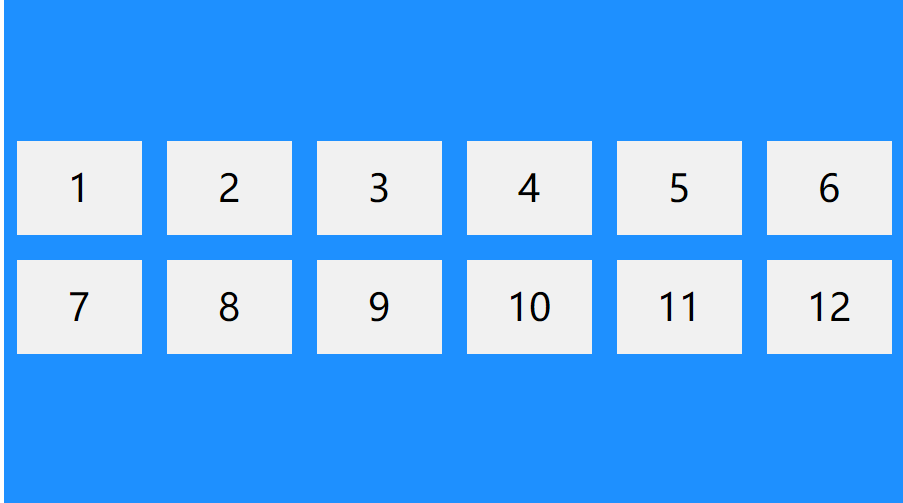

### flexbox

- CSS中一种布局，用来代替浮动
- flex使元素具有弹性，让元素随页面的大小改变

<br>

### 弹性容器

通过display设置弹性容器

1. display: flex; ------> 块级弹性容器
2. display: inline-flex; ------> 行内弹性容器


<br>


### 弹性元素 （子元素）

- flex 容器的直接子元素会自动成为弹性（flex）项目
- 弹性容器的直接子元素是弹性元素
- 一个元素可以同时为弹性元素和弹性容器

<br>


### 弹性容器的属性


```css
flex-direaction     指定容器中弹性元素的排列方式
    可选值：
        row：默认值，水平排列（从左向右）
        row-reverse：从右向左
        column：纵向排列 （从上到下）
        column-reverse：从下向上


主轴： 弹性元素的排列方向称为主轴
交叉轴： 与主轴交叉的轴


flex-wrap       设置弹性元素是否在弹性容器中自动换行
    可选值：
        nowrap：默认值，元素不会自动换行
        wrap：元素沿着交叉轴自动换行
        wrap-reverse：反方向换行


flex-flow       简写属性
    flex-flow: flex-direaction flex-wrap;


justify-content     （主轴上的元素如何水平对齐）
    可选值：
        flex-start：元素沿着主轴起始排列
        flex-end：元素沿着主轴终点排列
        center：元素居中排列
        space-around：空白分配到元素两侧
        space-evenly：空白分配到元素单侧
        space-between：起始和结束不分配空白，其余平均分配


align-items     （交叉轴的元素如何垂直对齐）
    可选值：
        stretch：默认值，垂直拉伸 flex 项目以填充容器
        center：将 flex 元素在容器垂直居中
        flex-start：将 flex 元素在容器顶部对齐
        flex-end：将弹性元素在容器底部对齐
        baseline：使 flex 项目基线对齐


align-content       （用于对齐弹性线）
    可选值：
        stretch：默认值，拉伸弹性线以占据剩余空间
        flex-start：在容器开头显示弹性线
        flex-end：在容器的末尾显示弹性线
        center：在容器中间显示弹性线
        space-around：显示弹性线在其之前、之间和之后带有空格
        space-between：显示的弹性线之间有相等的间距
      
```

**align-content: center**



<br>

<br>


<br>


### 弹性元素的属性

```css
flex-grow   指定元素的伸展系数 （当父元素有多余空间时，子元素如何伸展，父元素的剩余空间会按照比例分配)
    可选值：
        必须是数字，默认值是 0
        /* 默认值 */
        flex-grow:0;    不伸展


flex-shrink     指定元素的收缩系数 （当父元素中的空间不足以容纳所有子元素时，如何对子元素收缩）
    可选值：
        必须是数字，默认值是 0
        /* 默认值 */
        flex-shrink: 1;
        /* 不收缩 */
        flex-shrink：0；

        值越大收缩越多


order       规定 flex 项目的顺序
    可选值：
        必须为数字，默认值为0

<div class="flex-container">
  <div style="order: 3">1</div>
  <div style="order: 2">2</div>
  <div style="order: 4">3</div> 
  <div style="order: 1">4</div>
</div>


flex-basis      规定 flex 项目的初始长度
    可选值：
        auto：默认值，参考元素自身的宽度或高度
        100px：自定义数值
/* 将第三个弹性项目的初始长度设置为 200 像素 */
<div class="flex-container">
  <div>1</div>
  <div>2</div>
  <div style="flex-basis: 200px">3</div>
  <div>4</div>
</div>


flex        flex-grow、flex-shrink 和 flex-basis 属性的简写属性
    可选值：
        flex：flex-grow flex-shrink flex-basis
        initial：默认值，"flex: 0 1 auto"
        auto："flex：1 1 auto"
        none："flex:0 0 auto"


align-self      规定弹性容器内所选项目的对齐方式
    可选值：
        align-self 会覆盖容器的 align-items 属性
```


