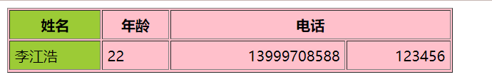
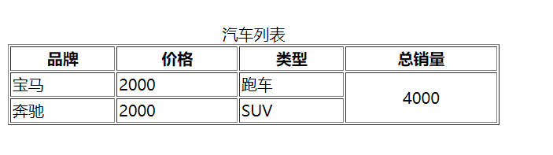

### 列表

 - 无序列表

```html
<ul>
  <li>豆浆</li>
  <li>油条</li>
  <li>豆汁</li>
  <li>焦圈</li>
</ul>
 ```

- 有序列表

```html
<ol>
  <li>沿着条路走到头</li>
  <li>右转</li>
  <li>直行穿过第一个十字路口</li>
  <li>在第三个十字路口处左转</li>
  <li>继续走 300 米，学校就在你的右手边</li>
</ol>
 ```

- 自定义列表

```html
<dl>
<dt>Coffee</dt>
<dd>Black hot drink</dd>
<dt>Milk</dt>
<dd>White cold drink</dd>
</dl>
 ```

 <br>

 <br>

 ### 表格

 ```html
 <table border="1" bgcolor="pink" cellpadding="5" width="500">
        <colgroup>
            <col style="background-color: yellowgreen;">
        </colgroup>
        <tr>
            <th>姓名</th>
            <th>年龄</th>
            <th colspan="2">电话</th>
        </tr>
        <tr>
            <td>李江浩</td>
            <td>22</td>
            <td align="right">13999708588</td>
            <td align="right">123456</td>
        </tr>
    </table>
 ```

 

 <br>

 <br>

 <br>

 ```html

<table border="1" width="500" id="table2">
    <!-- 使用 <caption> 为你的表格增加一个标题 -->
    <caption>Dinosaurs in the Jurassic period</caption>
  
    <!-- 表格在结构上有点复杂，如果把它们定义得更加结构化，那会帮助我们更能了解结构  -->
    <thead>
            <tr>
                <th>品牌</th>
                <th>价格</th>
                <th>类型</th>
                <th>总销量</th>
            </tr>
        </thead>

        <tbody>
            <tr>
                <td>宝马</td>
                <td>2000</td>
                <td>跑车</td>
                <td rowspan="2" align="middle">4000</td>
            </tr>
            <tr>
                <td>奔驰</td>
                <td>2000</td>
                <td>SUV</td>
            </tr>
        </tbody>

</table>
 ```

 