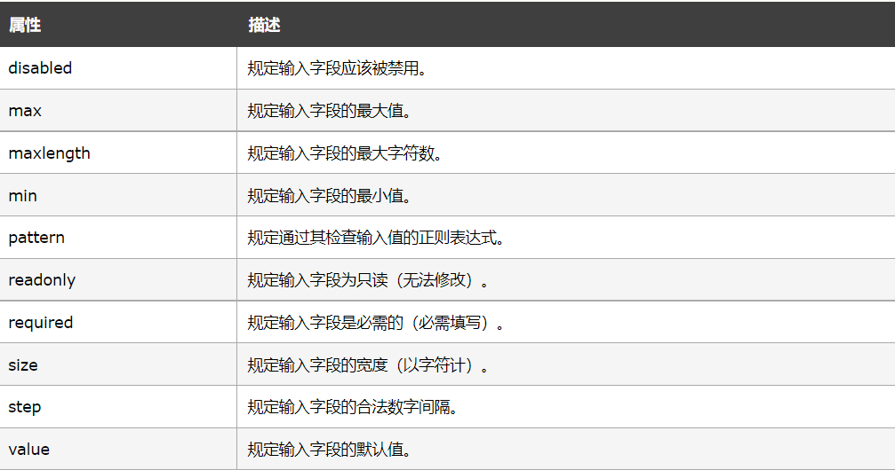

### form 元素

HTML 表单用于收集用户输入，将本地的数据提交到服务器

```html
<form action="action_page.php" method="GET" target="_blank" autocomplete="on">

</form>
```

- aciton属性：定义提交表单时要执行的操作，当用户单击“提交”按钮时，表单数据将发送到服务器上的文件中。
- method属性：规定在提交表单时所用的 HTTP 方法（GET 或 POST）
- target属性：规定提交表单后在何处显示响应,默认值为 ```_self```(响应显示在当前窗口中),```_blank```响应显示在新窗口或选项卡中
- ```autocomplete```属性（**HTML5新增）**：规定表单是否应打开自动完成功能，启用自动完成功能后，浏览器会根据用户之前输入的值自动填写值
- ```novalidate``` 属性: 设置，则 novalidate 规定在提交表单时不对表单数据进行验证

<br>

### input 元素

```html
<input type="text" name="lastname" value="Mouse">
``` 

元素有很多形态，根据不同的 type 属性：

- text：定义常规文本输入
- radio：定义单选按钮输入

```html
<form action="">
    <label for="">选择性别：</label>
    <input type="radio" name="sex" id="male"><label for="male">男</label>
    <input type="radio" name="sex" id="female"><label for="female">女</label>
</form> 
```

- submit：定义提交按钮
- password：密码字段，字符会被做掩码处理
- checkbox：复选框，允许用户在有限数量的选项中选择零个或多个选项
- button：按钮，默认没有功能
- file：文件
- image：图片
- reset：重置按钮，会清除表单中的所有数据
- hidden：定义隐藏的输入字段
- **HTML5 新增**：
  - color
  - date
  -  datetime
  -  datetime-local
  -  email
  -  month
  -  number
  -  range
  -  search
  -  tel
  -  time
  -  url
  -  week

**输入限制**：



<br>

<br>

<br>

**其他属性：**
 
- **name 属性：** 规定 input 元素的名称，只有设置了 name 属性的表单元素才能在提交表单时传递它们的值，因为服务端获取表单提交的数据是通过表单元素的 name 属性的值而得到的，没有 name 属性就无法得到表单元素提交给服务端的值
- **value 属性：** 规定输入字段的初始值
    - 当 type 的取值为 ```button、reset、submit``` 中的其中一个时，此时 value 属性的值表示的是按钮上显示的文本
    - 当 type 的取值为 ```text、password、hidden``` 中的其中一个时，此时 value 属性的值表示的是输入框中显示的初始值，此初始值可以更改，并且在提交表单时，value 属性的值会发送给服务器（既是初始值，也是提交给服务器的值）
    - 当 type 的取值为 ```checkbox、radio``` 中的其中一个时，此时 value 属性的值表示的是提交给服务器的值
    - 当 type 的取值为 image 时，点击它提交表单后，会将用户的点击位置相对于图像左上角的 x 坐标和 y 坐标提交给服务器
- **readonly 属性：** 规定输入字段为只读（不能修改）
- **disabled 属性：** 定输入字段是禁用的
- **size 属性：** 规定输入字段的尺寸（以字符计）
- **maxlength 属性：** 规定输入字段允许的最大长度

**HTML5新增属性：**

- **autofocus 属性:** 布尔属性，规定当页面加载时 ```<input>``` 元素应该自动获得焦点
- **height 和 width 属性：** 属性规定 ```<input>``` 元素的高度和宽度，仅用于 ```<input type="image">```
- **list 属性：** list 属性引用包含 input 元素的预定义选项的 datalist 元素
- **min 和 max 属性：** 规定 ```<input>``` 元素的最小值和最大值，适用于如需输入类型：**number、range、date、datetime、datetime-local、month、time 以及 week**
- **multiple 属性：** 布尔属性，定允许用户在 ```<input>``` 元素中输入一个以上的值，适用于以下输入类型：**email 和 file**
- **pattern 属性：** 规定用于检查 ```<input>``` 元素值的正则表达式，适用于以下输入类型：**text、search、url、tel、email、and password**

```html
<input type="text" name="country_code" pattern="[A-Za-z]{3}" title="Three letter country code">
```

- **placeholder 属性：** 规定用以描述输入字段预期值的提示，适用于以下输入类型：**text、search、url、tel、email 以及 password**
- **required 属性：** 布尔属性，规定在提交表单之前必须填写输入字段，适用于以下输入类型：**text、search、url、tel、email、password、date pickers、number、checkbox、radio、and file**
- **step 属性：** 规定 ```<input>``` 元素的合法数字间隔，如果 step="3"，则合法数字应该是 -3、0、3、6、等等。用于以下输入类型：**number、range、date、datetime、datetime-local、month、time 以及 week**
- **autocomplete 属性：** 规定表单或输入字段是否应该自动完成。当自动完成开启，浏览器会基于用户之前的输入值自动填写值。适用于 ```<form>``` 以及如下 ```<input>``` 类型：**text、search、url、tel、email、password、datepickers、range 以及 color**
- **form 属性：** 规定 ```<input>``` 元素所属的一个或多个表单
- **formaction 属性：** 覆盖 ```<form>``` 元素的 action 属性，适用于 **type="submit" 以及 type="image"**
- **formenctype 属性：** 规定当把表单数据（form-data）提交至服务器时如何对其进行编码,覆盖 ```<form>``` 元素的 enctype 属性,适用于 **type="submit" 以及 type="image"**
- **formmethod 属性：** 定义用以向 action URL 发送表单数据（form-data）的 HTTP 方法，覆盖 ```<form>``` 元素的 method 属性，适用于 **type="submit" 以及 type="image"**
- **formnovalidate 属性：** 布尔属性，规定在提交表单时不对 ```<input>``` 元素进行验证，覆盖 ```<form>``` 元素的 novalidate 属性，可用于 **type="submit"**
- **formtarget 属性：** 规定的名称或关键词指示提交表单后在何处显示接收到的响应，覆盖 ```<form>``` 元素的 target 属性，可与 **type="submit" 和 type="image"** 使用


<br>

### GET 和 POST 区别概述

**GET：** 

- 以名称/值对的形式将表单数据追加到 URL
- 永远不要使用 GET 发送敏感数据！（提交的表单数据在 URL 中可见！）
- URL 的长度受到限制（2048 个字符）
- GET 适用于非安全数据，例如 Google 中的查询字符串

**POST：**

- 将表单数据附加在 HTTP 请求的正文中（不在 URL 中显示提交的表单数据）
- POST 没有大小限制，可用于发送大量数据。
- 带有 POST 的表单提交无法添加书签
- 如果表单数据包含敏感信息或个人信息，请务必使用 POST


<br>

### ```<label>``` 标签

**for功能：** 表示这个Lable是为哪个控件服务的，Label标签要绑定了for指定HTML元素的ID或name属性，你点击这个标签的时候，所绑定的元素将获取焦点 ，点击label所包裹内容，自动指向for指定的id或name

```html
<label for="username">姓名</label><input id="username" type="text">
```


<br>

### ```<select>``` 元素（下拉列表）

```html
<select name="cars">
<option value="volvo">Volvo</option>
<option value="saab">Saab</option>
<option value="fiat">Fiat</option>
<option value="audi">Audi</option>
</select>
```

<br>

### ```<textarea>``` 元素

```<textarea>``` 元素定义多行输入字段（文本域）

```html
<textarea name="message" rows="10" cols="30">
The cat was playing in the garden.
</textarea>
 ```

 <br>

 ### ```<button>``` 元素

 ```html
<button type="button" onclick="alert('Hello World!')">Click Me!</button>
 ```

<br>

### HTML5 新增表单元素

- ```<datalist>```
- ```<keygen>```
- ```<output>```
