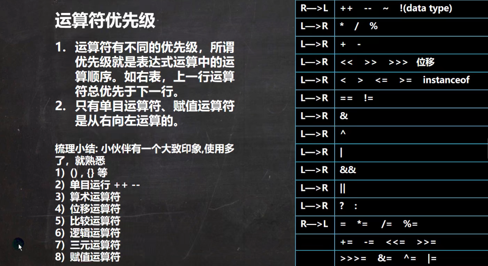

# 运算符

## 算数运算符


<br>

<br>

<br>


### 除法

**重点注意**

10/4 从数学角度结果为2.5，但是子Java中为2
10.0/4 结果为2.5

>原因：
如果相除的两个数都是整数，那么结果也是整数，这叫做取整除法。
如果其中有一个数浮点数，那么就是浮点除法，结果就是浮点数。

```java
System.out.println(10/4);   //2
System.out.println(10.0/4); //2.5
		
double d = 10/4;
System.out.println(d);  //2.0
```

<br>

### 取余数（取模）
10%3 为 10/3 的余数，结果为1

<br>

**注意**

```java
System.out.println(10%3);   //1
System.out.println(-10%3);   //-1
System.out.println(10%-3);   //1
```

>取模的本质：a % b = a - a / b * b

所以 10 % -3 = 10 - 10 / (-3) * (-3) = 10 - (-3) * (-3) =  10 - 9 = 1

<br>

### 自增

- ++i -> 先自增后赋值

```java
int a = 10;
int b = ++a; //等同于 a = a + 1; b = a;
System.out.println(b); //11

分析：前自增，a先自增+1后再把a自增后的值赋给b
```

- i++ -> 先赋值后自增

```java
int j = 10;
int i = j++; //等同于 i = j; j = j + 1;
System.out.println(i); //10

分析：后自增，先把j的值赋给i后j再自增+1
```

<br>

### 练习
```java
        //练习题
		int x = 1;
		x = x++; //规则使用临时变量：(1)temp = x; (2) x = x + 1; (3) x = temp;
		System.out.println(x);
		
		int y = 1;
		y = ++y; //规则使用临时变量：(1)y = y + 1; (2) temp = y; (3) y = temp;
		System.out.println(y);
```

<br>


## 关系运算符

- ==
- !=
- &gt;
- &lt;
- &gt;=
- &lt;=
- instanceof

<br>

## 逻辑运算符

- && (短路与)
- & (逻辑与)
    - 两者区别：
    - &&短路与：如果第一个条件结果为false，则返回最终结果false，第二个条件不会判断。
    - &逻辑与：无论第一个条件结果是否为false，第二个条件都有判断，效率低。
- || (短路或)
- | (逻辑或)
    - 两者区别：
    - 短路或：如果第一个条件结果为true，则返回最终结果true，第二个条件不会判断。
    - 短路与：无论第一个条件结果是否为true，第二个条件都有判断，效率低。
- ! (取反)
- ^ (逻辑异或a^b，a和b都不同时结果为true)

<br>

## 赋值运算符
- =
- +=
- -=
- *=
- /=
- %=

**注意**
复合赋值运算符会进行类型的转换

```java
byte i = 10;
i += 2; // 12,不报错，相当于 byte i = (byte)(i + 2)
i++; //13, 不报错，同理
```

<br>

## 三元运算符
基本语法：
> 条件表达式 ? 表达式1 : 表达式2;

运算规则：
> 如果条件表达式为true，运算后的结果为表达式1。 如果条件表达式为false，运算后的结果为表达式2

<br>

## 运算符优先级

       

<br>

<br>

<br>

## 键盘输入
Scanner类，表示简单的文本扫描器，在java.util包

```java
        import java.util.Scanner; //导入包

        //键盘输入
		Scanner s = new Scanner(System.in);
		System.out.println("请输入姓名：");
		String name = s.next(); //接收输入的字符串
		
		System.out.println("请输入年龄：");
		int age = s.nextInt(); //接收输入的整数
		
		System.out.println("请输入薪水：");
		double salary = s.nextDouble(); //接收输入的浮点数
		
		System.out.println("姓名\t年龄\t薪水\n" + name + "\t"+ age +"\t" + salary);
```


