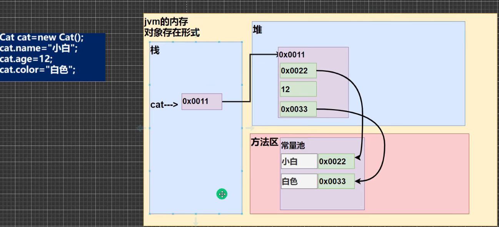
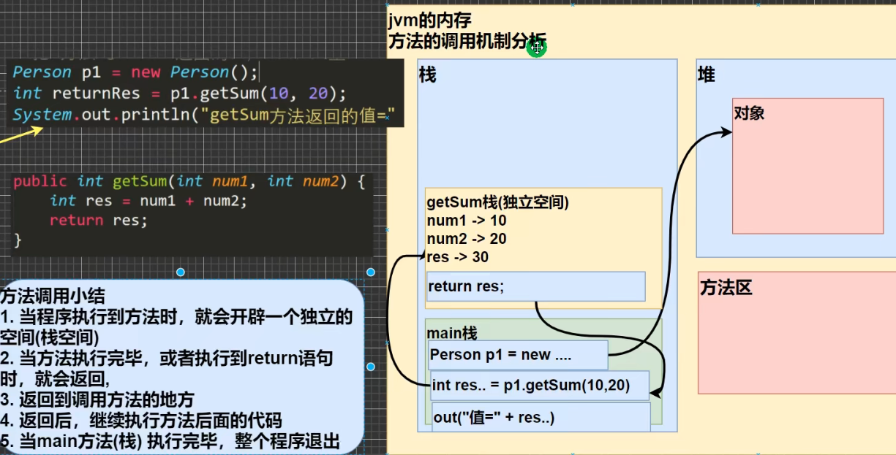

# 类与对象

**类**
类是抽象的，代表一类事物，比如人类，动物

**对象（实例）**
对象是具体的事物，比如张三，李四，对象是类的实例

<br>

### 对象的内存结构



- 栈：存放基本数据类型
- 堆：存放对象（包括数组）
- 方法区：常量池（比如字符串）

<br>

**创建对象实例的流程分析**
1. 加载类信息（属性和方法，只会加载一次）
2. 在堆中分配空间，进行默认初始化
3. 把地址值赋给对象实例，对象实例指向类
4. 进行指定初始化

<br>

<br>

<br>

### 对象的属性
属性如果不赋值，则有默认值
- int 0;
- short 0;
- byte 0;
- long 0;
- float 0.0;
- double 0.0;
- char \u0000;
- boolean false;
- String null;

<br>

### 成员方法

**方法调用机制**



<br>

<br>

<br>

**方法调用细节**

- 同一类中的方法调用：可以互相直接调用
- 跨类方法，A类调用B类方法：通过对象名调用

<br>

### 递归
方法自己调用自己，每次调用传入不同的变量

**方法递归调用注意事项**

1. 执行一个方法时，就创建一个新的独立空间（栈空间）
2. 方法的局部变量是独立的
3. 当一个方法执行完毕或者是遇到return，则返回

<br>

**练习题**

```java
    //猴子吃桃子: 有一堆桃子，猴子第一天吃了其中的一半并多吃一个，然后接下来每天都这么吃。直到第十天发现只剩一个桃子了，问最初总共有多少个桃子
	// 第十天：1个桃子	第九天：(day10 + 1) * 2 
	public int eatPeach(int day) {
		if(day == 10) {
			return 1;
		}else if (day >= 1 && day <= 9) {
			return (eatPeach(day + 1) + 1) * 2;
		}else{
			return -1;
		}
	}

    //阶乘
	public int factorial(int n) {
		if(n == 1) {
			return 1;
		}else {
			return factorial(n - 1) * n;
		}
	}
	
	//斐波那契数列
	public int fibonacci(int n) {
		if(n == 1 || n == 2) {
			return 1;
		}else {
			return fibonacci(n-1) + fibonacci(n-2);
		}
	}
```

<br>

### 递归难题

<br>

### 方法重载

Java中允许同一个类中，多个同名方法的存在，但要求形参列表不一致

```java
public class O7_Overload {
	public static void main(String[] args) {
		
		Methods test1 = new Methods();
		
		int maxI = test1.getNum(10, 29);
		System.out.println(maxI);
		
		double maxD = test1.getNum(10.0, 11.0);
		System.out.println(maxD);
	}
}

class Methods{
	public int getNum(int a,int b) {
		if(a > b) {
			return a;
		}else {
			return b;
		}
	}
	
	public double getNum(double a,double b) {
		if(a > b) {
			return a;
		}else {
			return b;
		}
	}
}
```

<br>

### 可变参数

Java中允许将同一个类中多个同名同功能但参数个数不同的方法，封装为一个方法

```java
    //可变参数， 可以接收多个int，nums可以当成数组
	public int sum(int... nums) {
		System.out.println(nums.length);
		
		for(int i = 0;i<nums.length;i++) {
			System.out.println(nums[i]);
		}
		
		return 0;
	}

    //练习题：可变参数返回姓名和各科成绩的总分
	public String showScore(String name, int... grades) {
		int sum = 0;
		for(int i = 0;i<grades.length;i++) {
			sum +=grades[i];
		}
		return "学生姓名:\t" + name + "\n" + "总成绩:\t\t" + sum;
	}
```

**注意事项及细节**

- 可变参数的实参可以为0或多个
- 可变参数的实参可以为数组
- 可变参数的本质是一个数组
- 可变参数可以和普通参数一起在形参列表，但要保证可变参数在普通参数后面，在参数列表最后
- 一个形参列表只能出现一个可变参数

<br>

### 作用域

- 全局变量：属性，作用域为整个类
- 局部变量：除类属性外的其他变量，一般指在成员方法中定义的变量，作用域为所在的代码块

**全局变量可以不赋值，有默认值。局部变量必须赋值，没有默认值**

<br>

**细节**

1. 类的属性变量可以和方法中的局部变量重名，访问时采用就近原则
2. 同一个成员方法中，以及同一个作用域下，不能定义重名局部变量
3. 属性的生命周期较长，随着对象的创建而创建，随着对象的销毁而销毁。局部变量生命周期较短，随着代码块的执行而创建，随着代码块的结束而销毁
4. 作用域范围不同：
   - 全局变量：可以在本类中使用，也可以在其他类中使用（通过对象调用）
   - 局部变量：只能在本类对应的方法中使用

5. 修饰符不同：
    - 全局变量/属性可以加修饰符
    - 局部变量无法加修饰符

<br>

### 构造器

构造器是类的一种特殊方法，主要作用为对新对象实例的初始化

<br>

1. 构造器的修饰符可以为默认，也可以为public、void、protected
2. 构造器没有返回值
3. 方法名和类名必须一样
4. 在创建对象时，系统会自动调用该类的构造器完成对类的初始化

Github desktop挂了


