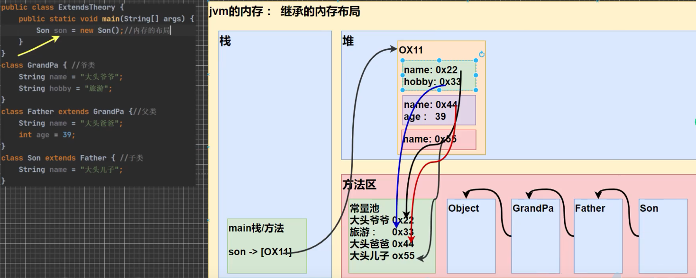

### 包

**包的作用**

- 区分相同名字的类
- 类很多时，可以规范的管理类
- 控制访问范围

```java
//声明包
package com.tecent;

//引入包
import com.tecent.Test;
```

<br>

**包的本质就是创建不同的文件夹来保存类文件**

<br>

**包的命名规范**

com.公司名称.项目名.业务模块

```java
com.sina.crm.user;
```

<br>

**常用的包**

- java.lang, 基本包，默认引入
- java.util, 系统提供的工具包，工具类
- java.net, 网络包，网络开发
- java.awt, Java界面开发，GUI

<br>


### 访问修饰符

用于控制方法和属性的访问权限

- public：对外公开
- protected：对子类和同一个包中的类公开
- 默认修饰符：没有修饰符，对同一包中的类公开
- private：只有类本身可以访问，不对外公开

<br>

|  修饰符 | 当前类 | 同包 | 子类 | 其他包 |
|  ---- | ---- | ---- | ---- | ---- | 
| public  | ✅ | ✅ | ✅ | ✅ |
| protected | ✅ | ✅ | ✅ |❌ |
| 默认修饰符  | ✅ | ✅ | ❌ | ❌ |
| private  | ✅ | ❌ | ❌ | ❌ |

<br>

# 面向对象编程三大特征

### 封装 （encapsulation）

封装是把抽象出来的属性和方法封装在一起，数据被保护在内部，程序其他部分必须被授权才能对数据进行访问和操作

**封装的优点**

1. 隐藏实现细节
2. 对数据进行验证，保证安全合理

<br>

**封装实现步骤**
1. 将属性进行私有化 （外部不能直接修改属性）
2. 提供公共的set方法，用于修改属性值
3. 提供公共的get方法，用于访问属性值

<br>

### 继承（Extends）

继承可以解决代码的复用问题，当多个类存在相同属性和方法时可以利用继承

```java
public class ExtendTest {
    public static void main(String[] args) {
        //子类继承父类的属性以及方法
        Undergraduate u = new Undergraduate();
        u.age = 23;
        u.setGrade(100.5);
        System.out.println(u.age);
        System.out.println(u.getGrade());

    }
}

class Student{
    String name;
    int age;
    private double grade;

    public  Student(){

    }

    public Student(String name,int age,double grade){
        this.name = name;
        this.age = age;
        setGrade(grade);
    }

    public double getGrade() {
        return grade;
    }

    public void setGrade(double grade) {
        this.grade = grade;
    }
}

//本科生继承学生类的属性
class Undergraduate extends  Student{

}
```

<br>

**继承的细节**

1. 子类继承了所有的属性和方法，但是私有属性不能在子类中直接访问和操作，需要使用public的方法去操作
2. 子类默认调用父类的构造器，完成父类的初始化
3. 当创建子类对象时，不管使用子类哪个构造器，默认情况下总会去调用父类的无参构造器，如果父类没有提供无参构造器，则必须在子类构造器中使用super关键字去指定使用父类的一种构造器完成父类的初始化，否则报错
4. super在使用时，必须放在构造器的第一行。super只能在构造器中使用，不能在成员方法中使用
5. super() 和 this() 在构造器中不能共存
6. Java所有类都是Object类的子类
7. 子类最多只能直接继承一个父类


<br>

**继承的内存分布**




