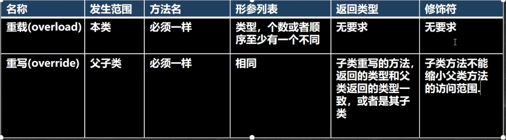

### 包

**包的作用**

- 区分相同名字的类
- 类很多时，可以规范的管理类
- 控制访问范围

```java
//声明包
package com.tecent;

//引入包
import com.tecent.Test;
```

<br>

**包的本质就是创建不同的文件夹来保存类文件**

<br>

**包的命名规范**

com.公司名称.项目名.业务模块

```java
com.sina.crm.user;
```

<br>

**常用的包**

- java.lang, 基本包，默认引入
- java.util, 系统提供的工具包，工具类
- java.net, 网络包，网络开发
- java.awt, Java界面开发，GUI

<br>


### 访问修饰符

用于控制方法和属性的访问权限

- public：对外公开
- protected：对子类和同一个包中的类公开
- 默认修饰符：没有修饰符，对同一包中的类公开
- private：只有类本身可以访问，不对外公开

<br>

|  修饰符 | 当前类 | 同包 | 子类 | 其他包 |
|  ---- | ---- | ---- | ---- | ---- | 
| public  | ✅ | ✅ | ✅ | ✅ |
| protected | ✅ | ✅ | ✅ |❌ |
| 默认修饰符  | ✅ | ✅ | ❌ | ❌ |
| private  | ✅ | ❌ | ❌ | ❌ |

<br>

# 面向对象编程三大特征

### 封装 （encapsulation）

封装是把抽象出来的属性和方法封装在一起，数据被保护在内部，程序其他部分必须被授权才能对数据进行访问和操作

**封装的优点**

1. 隐藏实现细节
2. 对数据进行验证，保证安全合理

<br>

**封装实现步骤**
1. 将属性进行私有化 （外部不能直接修改属性）
2. 提供公共的set方法，用于修改属性值
3. 提供公共的get方法，用于访问属性值

<br>

### 继承（Extends）

继承可以解决代码的复用问题，当多个类存在相同属性和方法时可以利用继承

```java
public class ExtendTest {
    public static void main(String[] args) {
        //子类继承父类的属性以及方法
        Undergraduate u = new Undergraduate();
        u.age = 23;
        u.setGrade(100.5);
        System.out.println(u.age);
        System.out.println(u.getGrade());

    }
}

class Student{
    String name;
    int age;
    private double grade;

    public  Student(){

    }

    public Student(String name,int age,double grade){
        this.name = name;
        this.age = age;
        setGrade(grade);
    }

    public double getGrade() {
        return grade;
    }

    public void setGrade(double grade) {
        this.grade = grade;
    }
}

//本科生继承学生类的属性
class Undergraduate extends  Student{

}
```

<br>

**继承的细节**

1. 子类继承了所有的属性和方法，但是私有属性不能在子类中直接访问和操作，需要使用public的方法去操作
2. 子类默认调用父类的构造器，完成父类的初始化
3. 当创建子类对象时，不管使用子类哪个构造器，默认情况下总会去调用父类的无参构造器，如果父类没有提供无参构造器，则必须在子类构造器中使用super关键字去指定使用父类的一种构造器完成父类的初始化，否则报错
4. super在使用时，必须放在构造器的第一行。super只能在构造器中使用，不能在成员方法中使用
5. super() 和 this() 在构造器中不能共存
6. Java所有类都是Object类的子类
7. 子类最多只能直接继承一个父类


<br>

**继承的内存分布**


<br>

<br>

<br>

### super关键字

super代表父类的引用，用于访问父类的属性、方法、构造器

1. 不能访问父类的private属性

```java
super.name; //访问父类的属性
```

2. 不能访问父类private方法

```java
super.sayHello(); //访问父类的方法
```

3. super() ，this() 只能放在构造器的第一句，且只能有一个

<br>

**细节**

- 调用父类构造器的优点，分工明确，父类由父类构造器初始化，子类由子类构造器初始化
- 当子类中的属性和方法与父类的重名时，必须通过super。如果没有重名，super、this、直接访问（不适用关键字）都可以
    - 比如调用一个方法时：
      1. 先找本类，如果存在则调用
      2. 如果本类不存在，往上向父类查找
      3. 如果父类不存在，继续往上一直到Object


<br>

### 方法重写 / 覆盖 （override）

子类有一个方法，和父类方法的名称、返回类型、参数都一样，则子类方法覆盖了父类方法

<br>

**细节**

- 子类重写父类的方法，方法名称和参数必须完全一样
- 子类方法的返回类型只能是和父类方法一样的返回类型，或者为父类方法返回类型的子类，比如：

```java
//父类方法
public Object findName(){
    return xxx;
}
//子类方法
public String findName(){
    return xxx;
}
```

- 子类方法不能缩小父类方法的访问权限（访问修饰符）：

private &lt; 默认 &lt; protected &lt; public

<br>

### 重载和重写的区别



<br>

<br>

<br>

### 多态

**方法的多态**
方法的重写和重载可以体现多态

<br>

**对象的多态**

1. 一个对象的编译类型和运行类型可以不一致 （父类的引用可以指向子类的对象）

```java
//编译类型：父类Person，运行类型：子类Student
Person p = new Student();
```

2. 编译类型在定义对象时就确定了，无法改变
3. 运行类型是可以改变的

<br>

**多态的向上转型**

1. 多态的前提为：两个对象（类）存在继承关系
2. 向上转型：父类的引用实例指向子类的对象
3. 可以调用父类的所有成员，不能调用子类的特有成员

```java
public class Polymorphism {
    public static void main(String[] args) {
        Father f = new Son();

        f.eat(); //可以执行，"eatS"

        f.sonSelf(); //无法执行,报错

    }
}

class Father{
    int age;
    String name;

    public void eat(){
        System.out.println("eatF");
    }
}

class Son extends Father{

    public void eat(){
        System.out.println("eatS");
    }

    public void sonSelf(){
         System.out.println("sonSelf");
    }
}
```

<br>

**多态的向下转型**

```java
Son s = (Son) f;
```

- 只能强转父类引用，不能强转父类对象
- 向下转型后，可以调用子类的所有成员
- 父类的引用必须指向当前目标类型的对象:

```java
//父类的引用先指向Son类
Father f = new Son();
//向下强转
Son s = (Son) f;
```

<br>

**编译类型与运行类型口诀**

- **属性看编译类型（=左边）**

- **方法调用看运行类型（=右边）**

<br>

### 动态绑定机制

1. 当调用对象方法时，该方法会和对象的内存地址 / 运行类型（=右边）绑定
2. 当调用对象属性时，没有动态绑定机制

<br>

### 多态的应用

**多态数组：**

数组的定义类型为父类型，里面保存的元素为子类类型
 
```java
public class PolymorphismArray {
    public static void main(String[] args) {
        Person[] person = new Person[3];
        person[0] = new Person("Eric",23);
        person[1] = new Student("Sean",24,50);
        person[2] = new Teacher("Clare",25,20000);

        for(int i = 0;i< person.length;i++){
            System.out.println(person[i].getSay()); //动态绑定机制

            if(person[i] instanceof Student){
                System.out.println(((Student) person[i]).getStudent());
            }

            if(person[i] instanceof Teacher){
                System.out.println(((Teacher) person[i]).getTeacher());
            }
        }
    }
}


class Person{
    private String name;
    private  int age;

    public Person(String name,int age){
        this.name = name;
        this.age = age;
    }

    public String getName() {
        return name;
    }

    public void setName(String name) {
        this.name = name;
    }

    public int getAge() {
        return age;
    }

    public void setAge(int age) {
        this.age = age;
    }

    public  String getSay(){
        return name + "\t" + age;
    }
}


class Student extends Person{
    private double grade;

    public Student(String name,int age,double grade){
        super(name,age);
        this.grade = grade;
    }

    public double getGrade() {
        return grade;
    }

    public void setGrade(double grade) {
        this.grade = grade;
    }

    public String getSay(){
        return super.getSay() + "\t" + grade;
    }

    public String getStudent(){
        return "学生:" + "\t" + getName() + "\t正在学Java";
    }
}

class Teacher extends Person{
    private double salary;

    public Teacher(String name, int age, double salary) {
        super(name, age);
        this.salary = salary;
    }

    public double getSalary() {
        return salary;
    }

    public void setSalary(double salary) {
        this.salary = salary;
    }

    public String getSay(){
        return super.getSay() + "\t" + salary;
    }

    public String getTeacher(){
        return "老师:" + "\t" + getName() + "\t正在教英语";
    }
}
```

<br>

### 多态小案例帮助更好理解多态

```java
public class PolymorphismPractice {
    public static void main(String[] args) {
        Employee m = new Manager("Eric",30000,50000);
        Employee s = new Staff("Sean",10000);

        TestTool t1 = new TestTool();
        t1.showEmployee(m);
        t1.showEmployee(s);
        t1.showType(m);
        t1.showType(s);
    }
}

class TestTool{
    public void showEmployee(Employee e){
        System.out.println(e.getAnnual());
    }

    public void showType(Employee e){
        if(e instanceof Staff){
            ((Staff)e).work();
        }
        if(e instanceof Manager){
            ((Manager)e).manage();
        }
    }
}

class Employee{
    private String name;
    private double salary;

    public Employee(String name,double salary) {
        this.name = name;
        this.salary = salary;
    }

    public double getSalary() {
        return salary;
    }

    public void setSalary(double salary) {
        this.salary = salary;
    }

    public String getName() {
        return name;
    }

    public void setName(String name) {
        this.name = name;
    }

    public double getAnnual(){
        double annual = salary * 12;
        return annual;
    }
}

class Staff extends Employee{
    public Staff(String name, double salary) {
        super(name, salary);
    }

    public void  work(){
        System.out.println("普通员工\t" + getName() + "\t正在工作" );
    }

    @Override
    public double getAnnual() {
        return super.getAnnual();
    }
}

class Manager extends Employee{
    private double bonus;

    public Manager(String name, double salary, double bonus) {
        super(name, salary);
        this.bonus = bonus;
    }

    public double getBonus() {
        return bonus;
    }

    public void setBonus(double bonus) {
        this.bonus = bonus;
    }

    public void manage(){
        System.out.println("经理\t" + getName() + "\t正在管理员工");
    }

    @Override
    public double getAnnual(){
        return (getSalary() * 12) + getBonus();
    }
}
```


