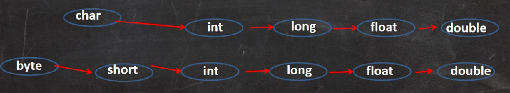

# 基本数据类型转换

### 自动类型的转换
- 当Java程序在进行赋值或运算的时候，精度小的数据类型自动转换为精度大的数据类型
- 数据的类型大小按精度排序为：



```java
int a = 'c'; //97
double d = 80; //80.0
```

- 有多种数据类型混合运算时，系统会自动把所以数据类型转换为容量（精度）最大的那种

```java
double d2 = 'c' + 88.1; //179.1 整体转换为double类型
```

- （byte，short）与char不会自动转换

```java
//当把数值赋给byte或short时，先判断该数是否在byte范围以内，如果是就正常赋值，不是则报错
byte b1 = 127; //如果是128则报错
```

- byte，short，char三者可以运算，运算结果会提升为int类型

```java
byte b2 = 100;
char c1 = 'L';
int result =  c1 + b2; //176，只能用int接收

short s1 = 10;
short s2 = 20;
short s3 = s1 + s2; //报错，因为short，byte，char与自己类型运算也会转为int
```

- boolean不参与自动转换

<br>

### 强制数据类型转换
将容量大的转换为容量小的数据类型，使用()强制转换符，但是**注意**会产生精度损失或数据溢出

```java
//强制数据类型转换
int i1 = (int) 12.4666666;
System.out.println(i1); //12,精度损失
		
byte b3 = (byte) 150;
System.out.println(b3); //-106,溢出
```

- char类型只能保持int的常量值，不能报错变量值
```java
char c1 = 100;//OK

int i1 = 100;
char c2 = i1; //报错

char c3 = (char)i1//OK
```

<br>

### 基本数据类型和String类型转换

- 基本数据类型转换为String类型：
  - 用+号拼接String都会转换为String类型
  - i.toString()
  - String.valueOf(num)
- String类型转换为基本数据类型要使用包装类：
  - Integer.parseInt()
  - Double.parseDouble()
  - Float.parseFloat();
  - Long.parseLong();
  - Byte.parseByte();
  - Boolean.parseBoolean();
  - Short.parseShort();

```java
//基本数据类型 -> String
int num = 10;
String s = num + "";

//String -> 基本数据类型
String s2 = "Eric";
int result = Integer.parseInt(s2);
```