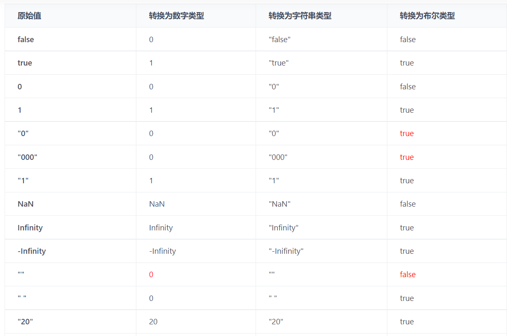
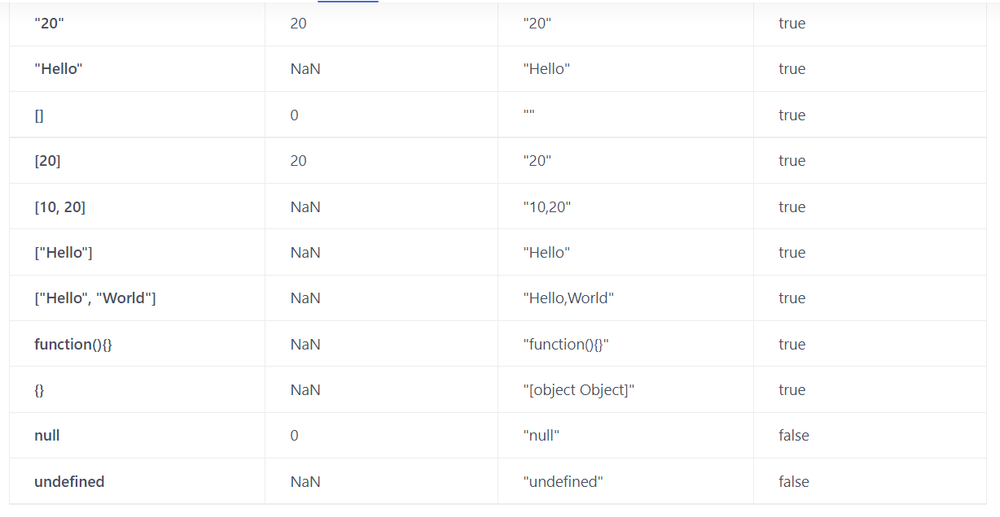

## 数据类型转换





<br>

<br>

<br>

<br>

<br>


### 引用类型转换为原始数据类型

值为引用数据类型时，会调用 JavaScript 内置的 ```@@ToPrimitive(hint)``` 方法来指定其目标类型

<br>

**有三种变体（variant），称为 “hint”**

1. String：对象到字符串的转换，如 “alert”

```javascript
// 输出
alert(obj);

// 将对象作为属性键
anotherObj[obj] = 123;
```

2. number：对象到数字的转换

```javascript
// 显式转换
let num = Number(obj);

// 数学运算（除了二元加法）
let n = +obj; // 一元加法
let delta = date1 - date2; //两个日期之间的差值

// 小于/大于的比较
let greater = user1 > user2;
```

3. default：当运算符“不确定”期望值的类型时 **（二元加法 + 可用于字符串（连接），也可以用于数字（相加），所以字符串和数字这两种类型都可以）**

```javascript
// 二元加法使用默认 hint
let total = obj1 + obj2;

// obj == number 使用默认 hint
if (user == 1) { ... };
```

<br>

**如何转换？**

1. 调用 ```obj[Symbol.toPrimitive](hint) ```，如果存在的话
2. 如果不存在，如果 hint 是 "string" —— 尝试 ```obj.toString()``` 和 ```obj.valueOf()```，无论哪个存在
3. 如果不存在，如果 hint 是 "number" 或 "default" —— 尝试 ```obj.valueOf()``` 和 ```obj.toString()```，无论哪个存在

<br>

<br>


1. **Symbol.toPrimitive**

<br>

```javascript
//重写
let user = {
  name: "John",
  money: 1000,

  [Symbol.toPrimitive](hint) {
    alert(`hint: ${hint}`);
    return hint == "string" ? `{name: "${this.name}"}` : this.money;
  }
};

// 转换演示：
alert(user); // hint: string -> {name: "John"}
alert(+user); // hint: number -> 1000
alert(user + 500); // hint: default -> 1500
```

<br>

2. **如果没有 Symbol.toPrimitive，那么 JavaScript 将尝试寻找 toString 和 valueOf 方法**

<br>

```javascript
//重写
let user = {
  name: "John",
  money: 1000,

  // 对于 hint="string"
  toString() {
    return `{name: "${this.name}"}`;
  },

  // 对于 hint="number" 或 "default"
  valueOf() {
    return this.money;
  }

};

alert(user); // toString -> {name: "John"}
alert(+user); // valueOf -> 1000
alert(user + 500); // valueOf -> 1500
```

<br>

<br>

### 如何让 ```a==1&&a==2&&a==3```的值为true？

```javascript
var a = { value : 0 };
a[Symbol.toPrimitive] = function(hint) {
console.log(hint); // default
return this.value += 1;
}
console.log(a == 1 && a == 2 && a == 3); // true


var a = { value : 0 };
a.valueOf = function() {
return this.value += 1;
};
console.log(a == 1 && a == 2 && a == 3); // true


var a = { value : 0 };
a.toString = function() {
return this.value += 1;
};
console.log(a == 1 && a == 2 && a == 3); // true
```

<br>

<br>

<br>

<br>

<br>

 ### 其他类型转为String

 - null：转为 "null"

<br>

 - undefined：转为 "undefined"

<br>

 - Boolean 类型：
   - true 转为 "true"
   - false 转为 "false"


<br>


- Number 类型：转为数字的字符串形式
  - 10 转为 "10"
  - 1e21 转为 "1e+21"

<br>


- Array 类型：转为字符串将各元素以小写逗号  ```, ``` 连接，当于调用数组 Array.prototype.join() 方法
  - 空数组转为空字符串 ''
  - 数组中 null 和 undefined 会被当作 空字符串 处理

<br>

- 普通对象：转为字符串相当于直接使用 Object.prototype.toString()，返回 [object Object]

<br>

```javascript
String(null);
// "null"

String(undefined);
// 'undefined'

String(true);
// 'true'

String(10);
// '10'

String(1e21);
// '1e+21'

String([1, 2, 3]);
// '1,2,3'

String([]);
// ''

String([null]);
// ''

String([1, undefined, 3]);
// '1,,3'

String({});
// '[object Objecr]'
```

<br>

<br>

### 其他类型转为Number

- null： 转为 0

<br>

- undefined：转为 NaN

- String 类型：如果是纯数字形式，则转为对应的数字
  - 空字符转为 0
  - 否则一律按转换失败处理，转为 NaN


- Boolean 类型：
  - true 将被转为 1
  - false 将被转为 0

<br>

```javascript
Number(null);
// 0

Number(undefined);
// NaN

Number('10');
// 10

Number('10a');
// NaN

Number('');
// 0

Number(true);
// 1

Number(false);
// 0

Number([]);
// 0

Number(['1']);
// 1

Number({});
// NaN
```

<br>

<br>

### 其他类型转为Boolean

假值只有 false、null、undefined、""、0 和 NaN，其他值转为 Boolean 类型都为 true

<br>

```javascript
Boolean(null);
// false

Boolean(undefined);
// false

Boolean('');
// flase

Boolean(NaN);
// flase

Boolean(0);
// flase

Boolean([]);
// true

Boolean({});
// true

Boolean(Infinity);
// true
```

<br>

<br>

### 显式类型转换

- 转换为数值类型
  - Number(mix)
  - parseInt(string, radix)
  - parseFloat(string)

- 转换为字符串类型
  - toString(radix)
    - null和undefined没有toString（）方法
  - String(mix)

- 转换为布尔类型
  - Boolean(mix)

<br>

<br>

### 隐式类型转换

- 转换为 Boolean 类型 **（逻辑判断 和 逻辑运算 时）**
- 相等运算符 ==
  - 如果其中一个操作值为布尔值，则在比较之前先将其转换为数值
  - 如果其中一个操作值为字符串，另一个操作值为数值，则通过 Number() 函数将字符串转换为数值
  - null 与undefined 是相等的
  - 如果一个操作值为 NaN，则返回 false
  - 如果两个操作值都是对象，则比较它们是不是指向同一个对象
  - 如果其中一个操作值是对象，另一个不是，则调用对象的 valueOf() 方法，得到的结果按照前面的规则进行比较
- 关系运算符：会把其他数据类型转换成 Number 之后再比较关系（除了 Date 类型对象）
  - 如果两个操作值都是数值，则进行 数值 比较
  - 如果两个操作值都是字符串，则比较字符串对应的 ASCII 字符编码值
  - 如果只有一个操作值是数值，则将另一个操作值转换为数值，进行 数值 比较
  - 如果一个操作数是对象，则调用 valueOf() 方法（如果对象没有 valueOf() 方法则调用 toString() 方法），得到的结果按照前面的规则执行比较
  - 如果一个操作值是布尔值，则将其转换为 数值，再进行比较
  - **NaN 是非常特殊的值，它不和任何类型的值相等，包括它自己，同时它与任何类型的值比较大小时都返回 false**

<br>

```javascript
!!undefined;
// false

!!null;
// false

!!1;
// true

!!'';
// false

!!'Hello';
// true

!!{};
// true

!![];
// true

!!function () {};
// true


'1' == true; // true
'1' == 1; // true
'1' == {}; // false
'1' == []; // false

undefined == undefined; // true
undefined == null; // true
null == null; // true


5 > 10;
// false

'2' > 10;
// false

'2' > '10';
// true

'abc' > 'b';
// false

'abc' > 'aad';
// true
```

<br>

- 转换为 Number 类型 **（当加号减号运算符作为一元运算符运算值时，它会将该值转换为 Number 类型）**
- **字符串连接符：** 如果两个操作数中只要存在一个操作数为 String 类型，那么另一个操作数会调用 String() 方法转成字符串然后拼接
- **算术运算符：** 如果两个操作数都不是 String 类型，两个操作数会调用 Number() 方法隐式转换为 Number 类型（如果无法成功转换成数字，则变为 NaN，再往下操作），然后进行加法算术运算
  - NaN：除了+号运算以为，任何类型和NaN计算都为NaN

```javascript
alert( 6 - '2' ); // 4，将 '2' 转换为数字
alert( '6' / '2' ); // 3，将两个运算元都转换为数字

// 转化非数字
alert( +true ); // 1
alert( +"" );   // 0


let apples = "2";
let oranges = "3";

// 在二元运算符加号起作用之前，所有的值都被转化为了数字
alert( +apples + +oranges ); // 5


' ' +
// 0

'0' +
// 0

'10' +
// 10

'String' +
// NaN

true +
// 1

false +
// 0

undefined +
// 0

null +
// 0

[] +
// 0

![] +
// 0

[1] +
// 1

[1, 2] +
// NaN

[[1]] +
// 1

[[1, 2]] +
// NaN

{} +
// NaN，当 {} + 任何值 时， 前一个 {} 都会被 JavaScript 解释成空块并忽略他

+'' +
// 0
```

<br>

- 转换为 String 类型

<br>

```javascript
// 用二元运算符 + 连接字符串
alert( '1' + 2 ); // "12"

alert(2 + 2 + '1' ); // "41"，不是 "221"

alert('1' + 2 + 2); // "122"，不是 "14"


"1" + 1             // "11"
"1" + "1"           // "11"
"1" + true          // "1true"
"1" + NaN           // "NaN"
"1" + []            // "1"
"1" + {}            // "1[object Object]"
"1" + function(){}  // "1function(){}"
"1" + new Boolean() // "1false"

1 + NaN             // NaN
1 + "true"          // "1true"
1 + true            // 2
1 + undefined       // NaN
1 + null            // 1

1 + []              // "1"
1 + [1, 2]          // "11,2"
1 + {}              // "1[object Object]"
1 + function(){}    // "1function(){}"
1 + Number()        // 1
1 + String()        // "1"

[] + []             // ""
{} + {}             // "[object Object][object Object]"
{} + []             // 0
{a: 0} + 1          // 1
[] + {}             // "[object Object]"
[] + !{}            // "false"
![] + []            // "false"
'' + {}             // "[object Object]"
{} + ''             // 0
[]["map"] + []      // "function map(){ [native code] }"
[]["a"] + []        // "undefined"
[][[]] + []         // "undefined"
+!![] + []          // 1
+!![]               // 1
1-{}                // NaN
1-[]                // 1
true - 1            // 0
{} - 1              // -1
[] !== []           // true
[]['push'](1)       // 1

(![]+[])[+[]]       // "f"
(![]+[])[+!![]]     // "a"
```