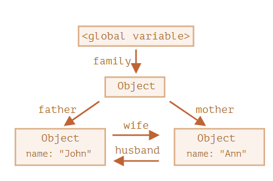
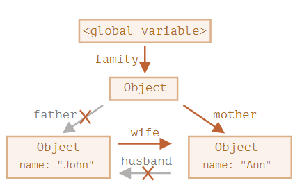
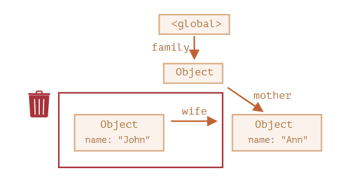

### 可达性（Reachability）

在 JavaScript 引擎中有一个被称作 垃圾回收器 的东西在后台执行。它监控着所有对象的状态，并删除掉那些已经不可达的

<br>

可达值是那些以某种方式可访问或可用的值，它们一定是存储在内存中的:

- 当前执行的函数，它的局部变量和参数
- 当前嵌套调用链上的其他函数、它们的局部变量和参数
- 全局变量
- 全局变量中有一个对象，并且该对象有一个属性引用了另一个对象，则 该 对象被认为是可达的，而且它引用的内容也是可达的

<br>

<br>

### 简单引用

```javascript
// user 具有对这个对象的引用
let user = {
  name: "John"
};

user = null; // John 变成不可达的了，因为没有引用了，就不能访问到它了。垃圾回收器会认为它是垃圾数据并进行回收，然后释放内存
```

<br>

<br>

### 两个引用

```javascript
// user 具有对这个对象的引用
let user = {
  name: "John"
};

let admin = user;
// 对象仍然可以被通过 admin 这个全局变量访问到，所以对象还在内存中
user = null;
```

<br>

<br>

### 相互关联对象

```javascript
function marry(man, woman) {
  woman.husband = man;
  man.wife = woman;

  return {
    father: man,
    mother: woman
  }
}

let family = marry({
  name: "John"
}, {
  name: "Ann"
});
```

<br>



<br>

<br>

```javascript
delete family.father;
delete family.mother.husband;

// 把这两个都删除，再也没有对 John 的引用了，John不可达被垃圾回收，从内存中删除
```

<br>



<br>

<br>



<br>

<br>

<br>

### 底层原理

垃圾回收的基本算法被称为 “mark-and-sweep”

<br>

定期执行以下“垃圾回收”步骤：

- 垃圾收集器找到所有的根，并“标记”（记住）它们
- 然后它遍历并“标记”来自它们的所有引用
- 如此操作，直到所有可达的（从根部）引用都被访问到
- 没有被标记的对象都会被删除


