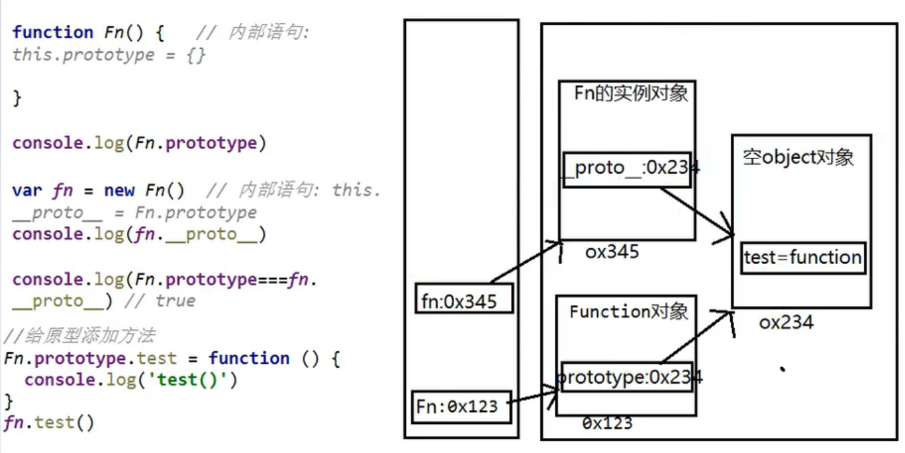
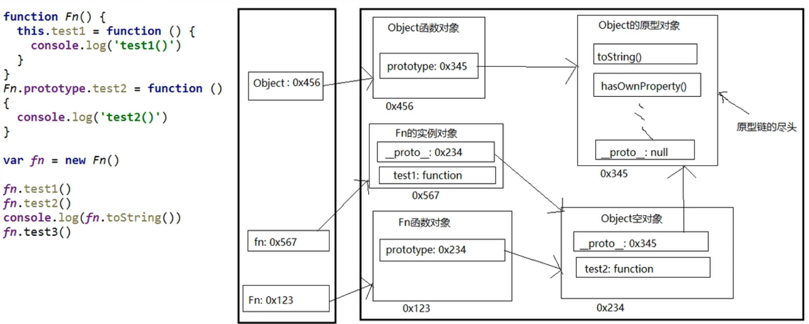
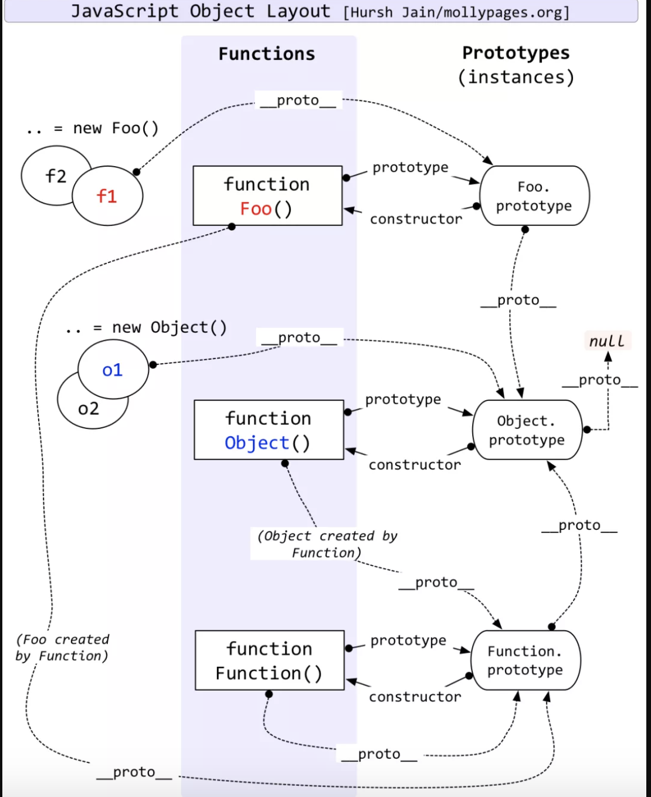

### 原型对象

原型对象就相当于一个公共的区域，可以被所有的该类实例所共享，所以我们可以将实例中共有的属性同意存储到原型中

<br>

每个函数对象都有一个属性叫做 prototype，该属性指向原型对象（Object空对象）

<br>

- 如果函数作为普通函数调用，原型对象（prototype）没有任何作用
- 如果函数作为构造函数调用（new）
  - 构造函数创建的对象实例存在一个隐含属性（```__proto__```）指向函数的原型对象（prototype）

<br>

```javascript
function Person(){

}

let p = new Person();
let p2 = new Person();

console.log(p.__proto__ === Person.prototype); //true
console.log(p2.__proto__ === Person.prototype); //true
```


<br>

<br>

### 原型访问方式

1. **显式原型**（```Person.prototype```） （构造函数使用方式）
2. **隐式原型**（```p.__proto__```）  （对象实例使用方式）
3. ```p.__proto__ === Person.prototype``` （相等）

<br>

- 函数的```prototype```属性：在定义函数的时候默认添加，默认指向一个空的Object实例对象
- 对象实例的```__proto__```属性：创建对象实例时自动添加，默认值为构造函数的prototype值
- 最好只操作```prototype```显示原型属性

<br>

<br>

### 原型对象的属性

- 原型对象有一个属性，constructor，指向函数对象

```javascript
function Person(name,age){
  this.name = name;
  this.age = age;
}
console.log(Person.prototype.constructor === Person);
```


<br>

<br>

### 原型对象中的方法

- 给原型对象添加方法、属性，所有实例对象自动拥有原型对象中的方法

<br>

```Object.prototype.toString()```

<br>

**重写**

```javascript
function Person(){

}

let p1 = new Person();

Person.prototype.toString = function(){
  return 
}
 ```

<br>





<br>

<br>

<br>

<br>

<br>

### 原型链

1. 如果访问一个对象属性，JS会先在对象本身寻找
2. 如果没找到则回去对象的原型（```__proto__```）中寻找
3. 如果还没找到，则去原型对象的原型（```__proto__```）中寻找
4. 直到找到Object对象的原型（null），则返回undefined


<br>



<br>

<br>

<br>

<br>

<br>




<br>

<br>

<br>

<br>

<br>

```javascript
Foo.prototype instanceof object //true
Object.prototype instanceof object //false
Function.prototype instanceof object //true
```

<br>

- 所有函数都是Function的实例（包括Function本身）

```javascript
Function.__proto__ === Function.prototype //true
```

<br>

