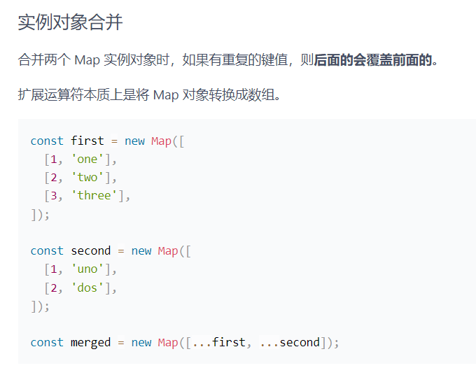
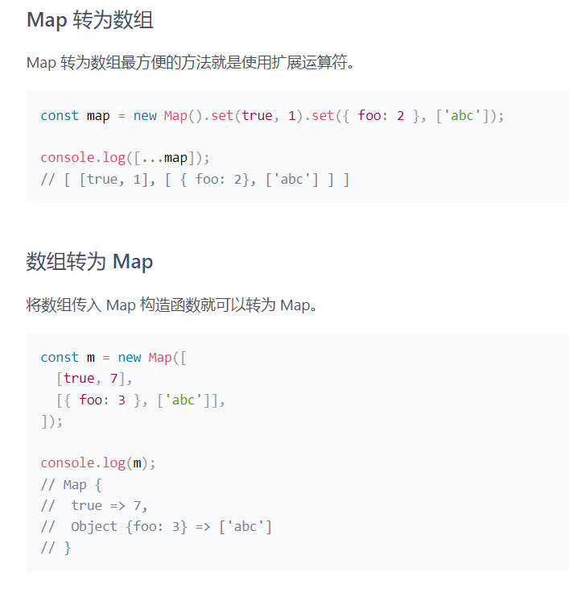

### Map

- Map 对象保存键值对。任何值（对象或者原始值）都可以作为一个键或一个值


<br>

<br>


### Map 和 Object 区别

1. 和 Object 对象不同，对象只能用字符串和 Symbol 作为键，而 Map 可以使用任何值
2. Map 中的键是有序的，而添加到对象中的键则不同
3. Map 可以通过 size 获取键值个数，Object 的键值对个数只能手动计算
4. Map 可直接进行迭代，而 Object 的迭代需要先获取它的键数组，然后进行迭代
5. Map 在涉及频繁增删键值对的场景下会有些性能优势


<br>

<br>

### 属性

```javascript
const map = new Map();

map.set('foo', true);
map.set('bear', false);

console.log(map.size);
// 2
```


<br>

<br>

### 方法

```javascript
// set 方法设置 key 对应的键值，然后返回整个 Map 结构。如果 Map 结构。如果 key 已经有值，则键值会被更新，否则就新生成该键
// 返回的是当前的 Map 对象，因此可以采用链式写法
const map = new Map();

// 键是字符串
map.set('edition', 6);
// 键是数值
map.set(262, 'standard');
// 键是 undefined
map.set(undefined, 'nah');

const m = new Map().set(1, 'a').set(2, 'b').set(3, 'c');


// get 方法读取 key 对应的键值，如果找不到 key，则返回 undefined
const m = new Map();

const hello = function () {
  console.log('hello');
};

m.set(hello, 'Hello ES6!');
// 键是函数

m.get(hello);
// Hello ES6!


// has 方法返回一个布尔值，表示某个键是否在 Map 数据结构中
const m = new Map();

m.set('edition', 6);
m.set(262, 'standard');
m.set(undefined, 'nah');

m.has('edition');
// true
m.has('years');
// false
m.has(262);
// true
m.has(undefined);
// true


// delete 方法删除某个键，返回 true 。如果删除失败，则返回 false
const m = new Map();
m.set(undefined, 'nah');
m.has(undefined);
// true

m.delete(undefined);
m.has(undefined);
// false


// clear 方法清除所有成员，没有返回值。
const map = new Map();

map.set('foo', true);
map.set('bar', false);
map.size;
// 2

map.clear();
map.size;
// 0


// forEach
const map = new Map();

map.set('1', { a: 1 });
map.set('2', { b: 2 });
map.set('3', { c: 3 });

map.forEach((value, key) => {
  console.log(key, value);
  // 1 { a: 1 }
  // 2 { b: 2 }
  // 3 { c: 3 }
});


// keys()
const map = new Map();

map.set('1', { a: 1 });
map.set('2', { b: 2 });
map.set('3', { c: 3 });

const keys = map.keys();

for (const key of keys) {
  console.log(key);
  // 通过 map.get(key) 可得 value 值
  // 1
  // 2
  // 3
}


// values()
const map = new Map();

map.set('1', { a: 1 });
map.set('2', { b: 2 });
map.set('3', { c: 3 });

const values = map.values();

for (const value of values) {
  console.log(value);
  // { a: 1 }
  // { b: 2 }
  // { c: 3 }
}


// entries
const map = new Map();

map.set('1', { a: 1 });
map.set('2', { b: 2 });
map.set('3', { c: 3 });

const entries = map.entries();

for ([key, value] of entries) {
  console.log(key, value);
  // 1 { a: 1 }
  // 2 { b: 2 }
  // 3 { c: 3 }
}
```


<br>

<br>

### 特性

### 内存地址绑定

- 只有对同一个对象的引用， Map 结构才将其视为同一个键
- Map 的键实际上是和内存地址绑定的，只要内存地址不一样，就视为两个键

<br>

```javascript
const map = new Map();

const a = ['foo'];
const b = ['foo'];

map.set(a, 123).set(b, 456);

map.get(a);
// 123

map.get(b);
// 456
```


<br>

<br>


### 基本类型值作为键名

- 如果 Map 的键是一个基本类型的值（数字、字符串、布尔值），则只要两个值严格相等，Map 就将其视为一个键，包括 0 和 -0

<br>

```javascript
const map = new Map();

map.set(-0, 123);
map.get(-0);
// 123

map.set(true, 1);
map.set('true', 2);
map.get(true);
// 1

map.set(undefined, 3);
map.set(null, 4);
map.get(undefined);
// 3

map.set(NaN, 123);
map.get(NaN);
// 123
```


<br>

<br>

### NaN 也可以作为 Map 对象的键


<br>

<br>

### 实践

<br>


