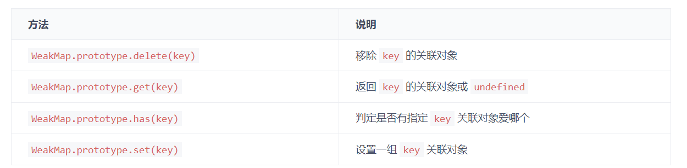

### WeakMap

- WeakMap 对象是一组键/值对的集合，其中的键是弱引用的。其键必须是对象，而值可以是任意的


<br>

<br>


### 对象键名

```javascript
const map = new WeakMap();

map.set(1, 2);
// TypeError: Invalid value used as weak map key

map.set(null, 2);
// TypeError: Invalid value used as weak map key
```


<br>

<br>


### 弱引用对象

- WeakMap 保持了对键名所引用的对象的弱引用
- WeakMap 保持了对键名所引用的对象的弱引用，即 垃圾回收机制 不将该引用考虑在内
- 只要所引用的对象的其他引用都被清除，垃圾回收机制就会释放该对象所占用的内存
- WeakMap 内部有多少个成员，取决于垃圾回收机制有没有运行，运行前后很可能成员个数是不一样的，而垃圾回收机制何时运行是不可预测的，因此 ES6 规定 WeakMap 不可遍历


<br>


