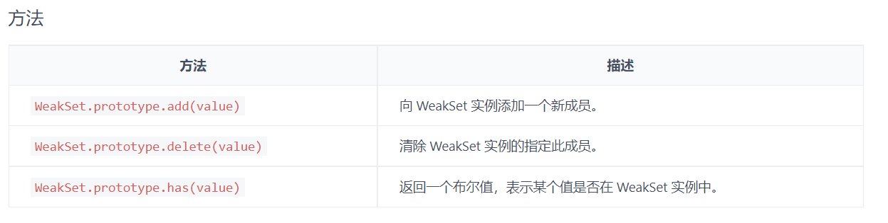

### WeakSet

- WeakSet 结构与 Set 类似，也是不重复的值的集合
- WeakSet 是一个构造函数。可以接受数组和类似数组的对象作为参数，**该数组的所有成员都会自动成为 WeakSet 的实例对象的成员**
- WeakSet 的成员只能是对象，而不能是其他类型的值
- WeakSet 中的对象都是弱作用，即垃圾回收机制不考虑 WeakSet 对该对象的引用
- WeakSet 不能遍历，因为成员都是弱作用

<br>




<br>

<br>

<br>

```javascript
// a 是一个数组，它有两个成员，也都是数组。将 a 作为 WeakSet 构造函数的参数，a的成员会自动成为 WeakSet 的成员
// 成为 WeakSet 的成员的是 a 数组的成员，而不是 a 数组本身，数组的成员只能是对象
const a = [
  [1, 2],
  [3, 4],
];
const ws = new WeakSet(a);
// WeakSet {[1, 2], [3, 4]}


// Wrong，数组b的成员不是对象
const b = [3, 4];
const ws = new WeakSet(b);
// Uncaught TypeError: Invalid value used in weak set(...)
```