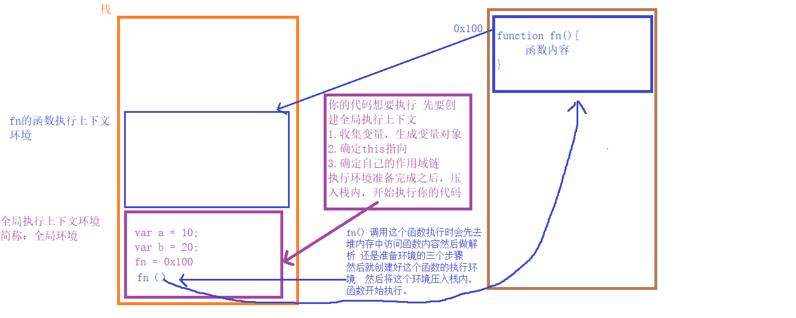

### 执行上下文相关

<br>

> 当前代码的执行环境，同一个函数在不同的环境中执行，会因为访问数据的不同产生不一样的结果


<br>

<br>


程序执行和代码执行是不同的

- 程序先执行，去创建能够让代码执行的环境 **（创建阶段）**
    1. 收集变量生成变量对象（预解析）
    2. 确定this指向
    3. 形成自己的作用域链

- 执行环境准备完成之后，压入执行上下文栈内，开始执行代码 **（执行阶段）**
    1. 变量赋值
    2. 函数调用
    3. 执行其他代码


<br>

<br>


### 执行上下文分为三种

<br>

window中的每一个函数都有自己的的执行环境（执行上下文环境）：程序在解析和运行的时候所依赖和使用的环境

<br>

- window的执行环境叫做：全局执行上下文 （JavaScript 代码运行起来会首先进入该环境，在浏览器中创建一个全局window对象）
    1. 在执行全局代码前将window确认为全局执行上下文
    2. 对全局数据进行预处理
    3. 全局对象
        - var ==> undefined，添加为window属性
        - 函数声明 ==> 赋值，添加为window方法
        - this ==> 指向全局window对象

    4. 全局Scope
        - let，const，class声明
        - 先到全局scope中找变量，查不到再去全局对象中查找

<br>

- 函数的执行环境叫做：函数执行上下文 （当函数被调用执行时，会进入当前函数中执行代码）
  - 每次调用都会为该函数创建一个新的执行上下文

<br>

- Eval 函数执行上下文

<br>

<br>



<br>

<br>

<br>

<br>

<br>

### 执行上下文的生命周期

<br>

1. 创建阶段
2. 执行阶段
3. 回收阶段

<br>

**创建阶段**

在 JavaScript 代码执行前，执行上下文将经历创建阶段:

1. this 值的决定
     - 在全局执行上下文中，this 的值指向全局对象
     - 在函数执行上下文中，this 的值取决于该函数是如何被调用的

<br>

2. 创建词法环境组件


<br>

3. 创建变量环境组件


<br>

<br>

**执行阶段**

- 执行变量赋值、代码执行


<br>

<br>

**回收阶段**

- 执行上下文出栈等待垃圾回收器回收执行上下文

<br>

<br>

### 执行上下文栈

<br>

- 程序为了管理执行上下文（确保程序的执行顺序）所创建的一个栈数据结构
- 在一个 JavaScript 程序中，必定会产生多个执行上下文，而 JavaScript 引擎会以栈的方式来处理它们，这个栈，我们称其为 函数调用栈（Call Stack）。栈底永远都是全局上下文，而栈顶就是当前执行的上下文

<br>

```javascript
function fun3() {
  console.log('fun3');
}

function fun2() {
  fun3();
}

function fun1() {
  fun2();
}

fun1();

// 当执行一个函数的时候，就会创建一个执行上下文，并且压入执行上下文栈，当函数执行完毕的时候，就会将函数的执行上下文从栈中弹出

// fun1()
ECStack.push(<fun1> functionContext);

// fun1 中竟然调用了 fun2，还要创建 fun2 的执行上下文
ECStack.push(<fun2> functionContext);

// 擦，fun2 还调用了 fun3！
ECStack.push(<fun3> functionContext);

// fun3 执行完毕
ECStack.pop();

// fun2 执行完毕
ECStack.pop();

// fun1 执行完毕
ECStack.pop();

// JavaScript 接着执行下面的代码，但是 ECStack 底层永远有个 globalContext
```

<br>

- JavaScript 引擎是单线程的
- 同步执行，只有栈顶的上下文处于执行中，其他上下文需要等待
- 全局上下文只有唯一的一个，它在浏览器关闭时出栈
- 每次某个函数被调用，就会有个新的执行上下文为其创建，即使是调用的自身函数，也是如此

<br>

<br>


### 整体流程

1. 创建全局执行上下文，加入执行上下文栈顶

<br>


2. 预解析
     - 找到所有的var声明（非函数）
     - 找到所有全局函数声明
     - 找到所有let，const，class声明

<br>


3. 名字重复处理

     - let，const，class声明名字不能重复
     - let，const，class 和 var，function名字不能重复
     - var和function名字重复，function优先

<br>

4. 声明

   - var：声明并初始化为undefined
   - 函数声明：声明并初始化为函数对象
   - 块级作用域中的函数声明：声明并初始化为undefined
   - let，const，class：声明但是不初始化

<br>

5. 执行代码


<br>

<br>


### 变量对象 （预解析）

变量对象是与 **执行上下文** 相关的数据作用域，存储了在上下文中定义的 变量 和 函数声明

<br>

- 全局执行上下文：全局执行上下文中的变量对象就是全局对象
- 函数执行上下文：在函数执行上下文中，我们用 活动对象（Activation Object，AO）来表示变量对象

<br>

<br>

**执行过程：**

1. 分析：进入执行上下文
2. 执行：代码执行


<br>

**进入执行上下文阶段的变量对象：**

 1. 函数的所有形参（如果是函数执行上下文）
    - 建立 Arguments 对象
    - 检查当前上下文的参数，由名称和对应值组成的一个变量对象的属性被创建
    - 没有实参，属性值设为 undefined

2. 函数声明

    - 检查当前上下文的函数声明，也就是使用 function 关键字声明的函数
    - 在变量对象中以函数名建立一个属性，属性值为指向该函数所在内存地址的引用
    - 如果变量对象已经存在相同名称的属性，那么该属性将会被新的引用所覆盖

3. 变量声明

    - 检查当前上下文中的变量声明
    - 每找到一个变量声明，就在变量对象中以变量名建立一个属性，属性值为 undefined
    - 如果变量名称与已经声明的形式参数或函数相同，则变量声明不会干扰已经存在的这类属性（直接跳过忽略）

<br>

```javascript
function foo(a) {
  var b = 2;

  function c() {}

  var d = function () {};

  b = 3;
}


AO = {
  arguments: {
      0: 1,
      length: 1
  },
  a: 1,
  b: undefined,
  c: reference to function() {},
  d: undefined
}
```

<br>


<br>


**代码执行阶段的变量对象：**

- 在代码执行阶段，会根据代码，顺序执行代码，修改变量对象的值

<br>

```javascript
AO = {
  arguments: {
    0: 1,
    length: 1
  },
  a: 1,
  b: 3,
  c: reference to function c(){},
  d: reference to FunctionExpression "d"
}
```

<br>

<br>

> VO 和 AO 到底是什么关系？

- 未进入执行阶段之前，变量对象（VO：Variable Object）中的属性都不能访问
- 进入执行阶段之后，活动对象（AO：Activation Object）被激活，里面的属性包括 VO、函数执行时传入的参数和 Arguments 对象都能被访问了，然后开始进行执行阶段的操作


