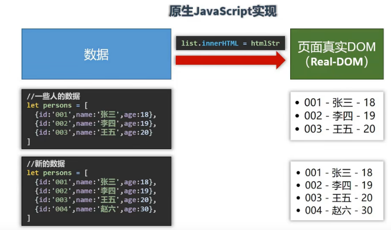
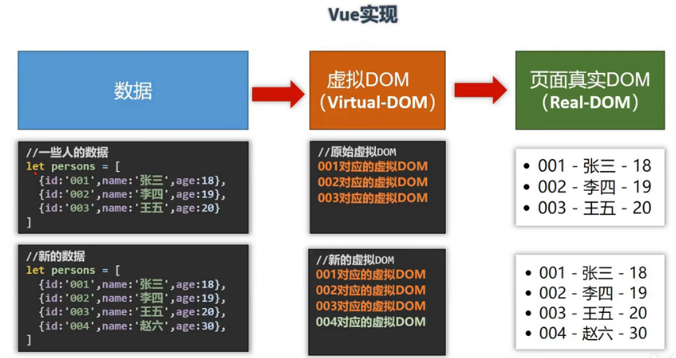

### Vue 特点

1. 采用**组件化**模式，提高代码复用率
    - 组件化概念：把页面的一个部分、版块（比如新闻列表）封装到一个vue文件，简而言之，就是一个vue文件代表整个项目的一个小部分
    - 一个组件就包含了（HTML，CSS，JS）

 

2. **声明式**编码，使用指令，无需进行繁琐的DOM操作

 

3. 使用**虚拟DOM**和**Diff算法**，不直接操作真实DOM，尽量多的复用DOM节点

 

 

 

 

 

 

 

 

 

 

 

 

 

