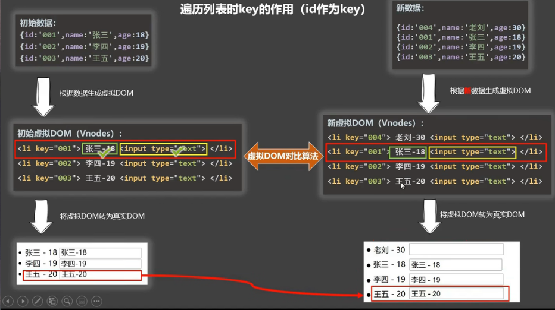

### 基本使用

<br>

```html
<body>
    <div id="root">
        <!-- 遍历数组 -->
       <ul>
           <li v-for="(item,index) in persons" :key="item.id">{{item.id}} - {{item.name}} - {{item.age}}</li>
       </ul>

       <hr>

       <!-- 遍历对象 -->
        <ul>
            <li v-for="(value,key) in animal" :key="key">{{key}} - {{value}}</li>
        </ul>
    </div>

    <script>
        const vm = new Vue({
            el:"#root",
            data(){
                return{
                    persons:[
                        {id:"001",name:"Eric",age:23},
                        {id:"002",name:"Clare",age:25},
                        {id:"003",name:"Sean",age:24}
                    ],
                    animal:{
                        name:"狮子",
                        age:10,
                        gender:"公"
                    }
                }
            }
        })
    </script>
```


<br>

<br>

### 为什么key不建议用index索引？

- 首先key的主要作用是虚拟DOM的对比算法，key是在新旧 nodes 对比时辨识 VNodes 的**唯一标识**，使用 key 时，它会基于 key 的变化重新排列元素顺序，并且会移除 key 不存在的元素
- 有相同父元素的子元素必须有独特的 key，重复的 key 会造成渲染错误
- 所以使用index作为key不能保证key的唯一性

<br>

<br>


<br>

<br>

<br>

<br>

<br>

<br>




<br>

<br>

<br>

<br>

<br>

<br>


### 小案例

<br>

```html
<body>
    <div id="root">
        <input type="text" placeholder="输入名称搜索变形金刚" v-model="keyWord"/>
        <button @click="sortNum = 2">年龄升序</button>
        <button @click="sortNum = 1">年龄降序</button>
        <button @click="sortNum = 0">原顺序</button>

        <ul>
            <li v-for="(item,index) in newPersons" :key="item.id">{{item.name}} - {{item.team}} - {{item.age}}</li>
        </ul>
    </div>

    <script>
        const vm = new Vue({
            el:"#root",
            data(){
                return{
                    persons:[
                        {id:"001",name:"威震天",age:23,team:"霸天虎"},
                        {id:"002",name:"擎天柱",age:25,team:"汽车人"},
                        {id:"003",name:"大黄蜂",age:24,team:"汽车人"},
                        {id:"004",name:"禁闭",age:24,team:"霸天虎"}
                    ],
                    keyWord:"",
                    sortNum:0
                }
            },
            methods:{
                // 不是好办法
                // search:function(){
                //     this.newPersons = this.persons.filter((item)=>{
                //         return item.name.indexOf(event.target.value) !== -1
                //     });
                // }
            },
            computed:{
                newPersons:{
                    get(){
                        const arry = this.newPersons = this.persons.filter((item)=>{
                            return item.name.indexOf(this.keyWord) !== -1
                        });

                        if(this.sortNum === 1){
                            // 降序
                            arry.sort((a,b)=>{
                                return b.age - a.age;
                            })
                        }else if(this.sortNum === 2){
                            // 升序
                            arry.sort((a,b)=>{
                                return a.age - b.age;
                            })
                        }

                        // 不排序
                        return arry;
                        
                    },
                    set(){
                        
                    }
                }
            }
        })
    </script>
</body>
```


