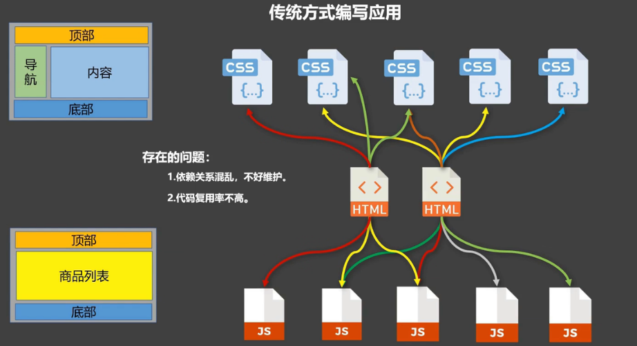
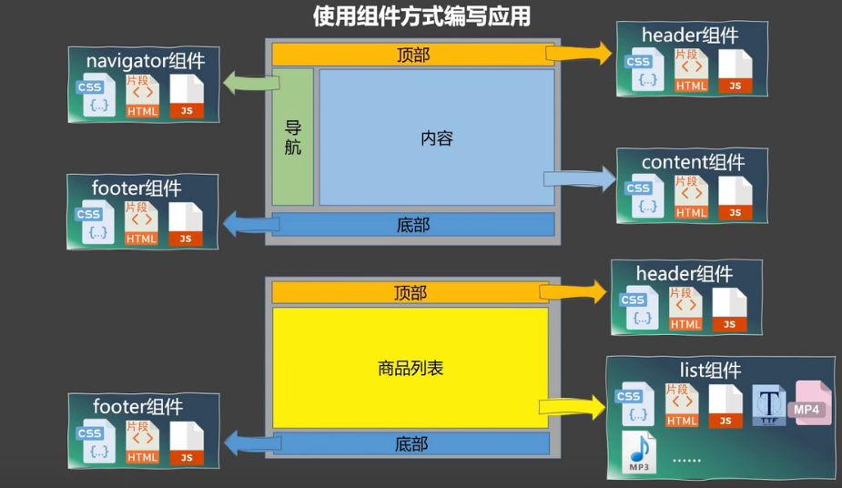
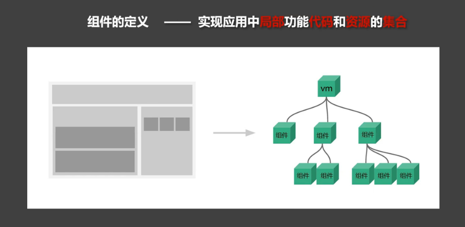

### 传统方式编写应用

 

 

 

 

 

 

 

### 使用组件方式编写应用

 

 

 

 

 

 

 

 

 

 

### 模块 vs 组件, 模块化 vs 组件化

 

- **模块**

- 向外提供特点功能的js程序,一般为一个js文件
- 作用: 复用js, 提高效率

 

- **组件**

- 用来实现局部 (特定) 功能效果的代码集合 (包含html / css / js / image......)

 

 

- **模块化**

- 当应用中的js都以模块来编写, 那这个应用为一个模块化应用

 

- **组件化**

- 当应用中的功能都是多组件的方式来编写, 那这个应用为一个组件化应用