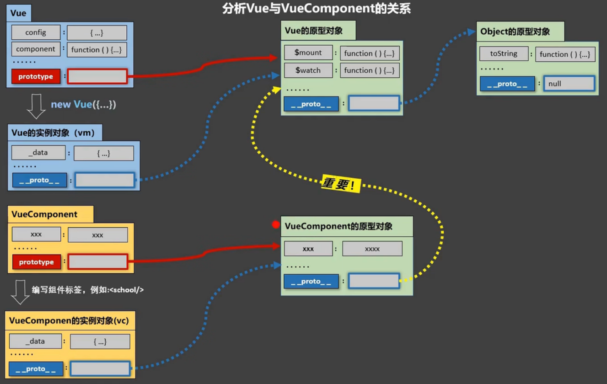

### 非单文件组件

<br>

- 一个文件中包含有 n 个组件

<br>

<br>

**VueComponent:**

1. school组件本质为一个名为 ```VueComponent``` 的构造函数,是由 ```Vue.extend``` 产生的

<br>

2. ```<school></school>```, Vue解析模板时会创建school组件的实例对象, 即自动执行: ```new VueComponent(options)```

<br>

3. 每次调用 ```Vue.extend```, 返回的都是一个全新的 ```VueComponent```

<br>

<br>

关于this:

1. new Vue({})中:
    - data函数, method中的函数, watch中的函数, computed中的函数, this均指向 **Vue实例对象**


2. 组件中:
    -  data函数, method中的函数, watch中的函数, computed中的函数, this均指向  **VueComponent实例对象**

<br>

<br>

### VueComponent 和 Vue 内置关系

<br>

- ```VueComponent.prototype.__proto__ == Vue.prototype```
- 组件的实例对象也可以访问到Vue原型上的属性和方法

<br>



<br>

<br>

<br>

<br>

<br>

<br>


### 组件代码演示

```html
<body>
    <div id="root">
        <school></school>

        <br>
        <hr>
        <br>

        <student></student>
        

        <hello></hello>
    </div>

    <script>
        // 创建school组件
        const school = Vue.extend({
            template:`
            <div>
                <h2>学校: {{schoolName}}</h2>
                <h2>地址: {{address}}</h2>
            </div>
            `,
            data(){
                return{
                    schoolName:"polyU",
                    address:"HongKong"
                }
            }
        })

        // 创建student组件
        const student = Vue.extend({
            template:`
            <div>
                <h2>姓名: {{studentName}}</h2>
                <h2>年龄: {{age}}</h2>
            </div>
            `,
            data(){
                return{
                    studentName:"Eric",
                    age:23
                }
            }
        })

        const hello = Vue.extend({
            template:`
            <div>
                <h2>Hello, {{name}}</h2>
            </div>
            `,
            data(){
                return{
                    name:"Vue"
                }
            }
        });

        // 注册全局组件
        Vue.component("hello",hello);

        new Vue({
            el:"#root",
            // 注册组件 (局部注册)
            components:{
                school:school,
                student:student
            }
        });      
    </script>
</body>
```

<br>

<br>


### 组件嵌套

<br>

```html
<body>
    <div id="root">
        <app></app>
    </div>

    <script>
         // 创建student组件
         const student = Vue.extend({
            template:`
            <div>
                <h2>姓名: {{studentName}}</h2>
                <h2>年龄: {{age}}</h2>
            </div>
            `,
            data(){
                return{
                    studentName:"Eric",
                    age:23
                }
            }
        })

        // 创建school组件
        const school = Vue.extend({
            template:`
            <div>
                <h2>学校: {{schoolName}}</h2>
                <h2>地址: {{address}}</h2>
                <student></student>
            </div>
            `,
            data(){
                return{
                    schoolName:"polyU",
                    address:"HongKong"
                }
            },
            components:{
                student:student
            }
        })

        // app组件
        const app = Vue.extend({
            template:`
            <school></school>   
            `,
            components:{
                school:school
            }
        })

        new Vue({
            el:"#root",
            components:{
                app:app
            }
        });      
    </script>
</body>
```

<br>

<br>

