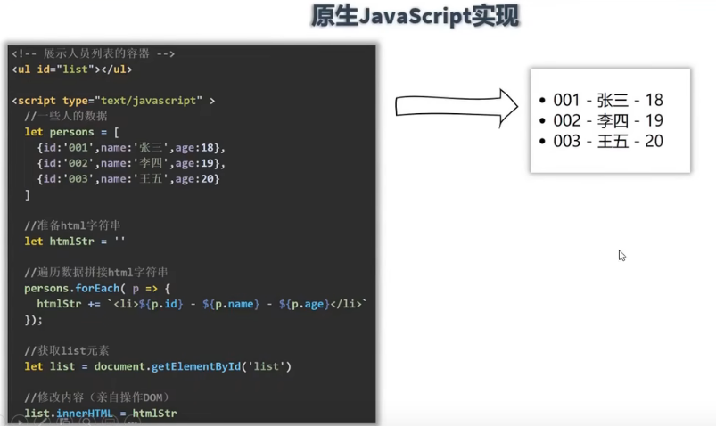
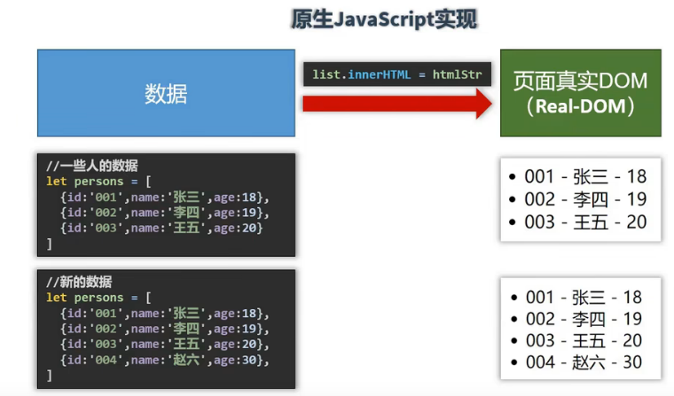

### Vue 特点

<br>

- 一套用于构建用户界面的渐进式框架
- Vue 被设计为可以自底向上逐层应用
- Vue 的核心库只关注视图层

<br>

<br>

1. 采用**组件化**模式，提高代码复用率
    - 组件化概念：把页面的一个部分、版块（比如新闻列表）封装到一个vue文件，简而言之，就是一个vue文件代表整个项目的一个小部分
    - 一个组件就包含了（HTML，CSS，JS）

<br>

2. **声明式**编码，使用指令，无需进行繁琐的DOM操作

<br>

3. 使用**虚拟DOM**和**Diff算法**，不直接操作真实DOM，尽量多的复用DOM节点

<br>




<br>

<br>

<br>




<br>

<br>

<br>


<br>

<br>

<br>

<br>

<br>

<br>

### Vue 实例

- 每个 Vue 应用都是通过用 Vue 函数创建一个新的 Vue 实例开始
- 当一个 Vue 实例被创建时，它将 data 对象中的所有的 property 加入到 Vue 的响应式系统中
- 当这些数据改变时，视图会进行重渲染
- **但是注意**，如果手动添加一个新的 property （```vm.b = 'hi'```） ，那么对 b 的改动将不会触发任何视图的更新


<br>


```javascript
<!DOCTYPE html>
<html lang="en">
<head>
    <meta charset="UTF-8">
    <meta http-equiv="X-UA-Compatible" content="IE=edge">
    <meta name="viewport" content="width=device-width, initial-scale=1.0">
    <title>Document</title>
    <script src="./js/vue.js"></script>
</head>
<body>
    <!-- 容器 -->
    <div id="root">
        <h1>Hello {{name}}</h1>
    </div>

    <div class="root">
        <h1>Hello {{name}}</h1>
    </div>

    <script>
        // 创建vue实例
        const vm = new Vue({
            // el用于指定当前Vue实例为哪个容器服务
            el:"#root",
            data:{
                name:"Vue"
            }
        });


        const vm2 = new Vue({
            el:".root",
            data:{
                name:"Eric"
            }
        });
    </script>
</body>
</html>
```
