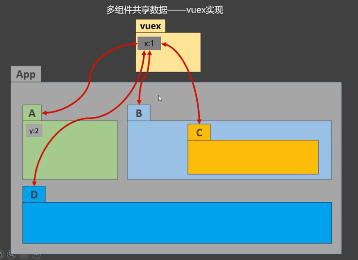

### Vuex

 

- 在Vue中实现集中式状态管理的一个Vue插件，对Vue应用中的多个组件的共享状态进行集中式的管理 （读/写），是一种组件间通信的方式，适用于任意组件间通信

 

> 何时使用Vuex

 

1. 多个组件依赖于同一状态
2. 来自不同组件的行为需要变更同一状态

 

 

 

 

 

### 组成部分

 

 

 

 

 

 

 

1. Vue Components：Vue组件用于派遣任务到Actions
2. Actions：用于提交 mutation，而不是直接变更状态，可以包含任意异步操作（发送请求、与后端交互）
3. Mutations：是唯一更改 store 中状态的方法，且必须是同步函数
4. State：定义了应用状态的数据结构，可以在这里设置默认的初始状态
5. Getter：允许组件从 Store 中获取数据
6. Module：允许将单一的 Store 拆分为多个 store 且同时保存在单一的状态树中