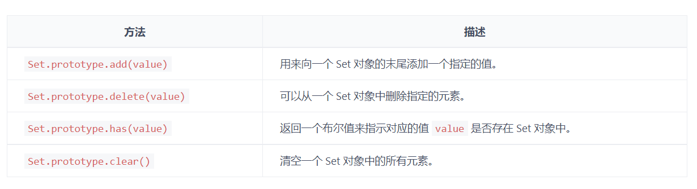

### Set

- Set 对象允许你存储任何类型的唯一值，无论是原始值或者是对象引用
- Set 的遍历顺序就是插入顺序


<br>

<br>


### 属性

- Set.prototype.size：返回Set 实例的成员总数


<br>

<br>


### 方法



<br>

<br>

<br>


```javascript
// Set.prototype.keys()：用于获取 Set 对象中的按插入顺序排列的所有元素的值
let set = new Set(['x', 'y', 'z']);

for (let item of set.keys()) {
  console.log(item);
}
// Output: 'x'
// Output: 'y'
// Output: 'z'


// Set.prototype.values()
let set = new Set(['x', 'y', 'z']);

for (let item of set.values()) {
  console.log(item);
}
// Output: 'x'
// Output: 'y'
// Output: 'z'


// Set.prototype.entries()：返回的遍历器同时包括键名和键值，所以每次输出一个数据，其两个成员完全相等
let set = new Set(['x', 'y', 'z']);

for (let item of set.entries()) {
  console.log(item);
}
// Output: ["x", "x"]
// Output: ["y", "y"]
// Output: ["z", "z"]


// Set.prototype.forEach()
let set = new Set([1, 2, 3]);

set.forEach((value, key) => console.log(value * 2));
// Output: 2
// Output: 4
// Output: 6
```

<br>

<br>

### 基本用法 , 遍历

```javascript
const s = new Set();

[2, 3, 5, 4, 5, 2, 2].forEach(x => s.add(x));

for (let i of s) {
  console.log(i);
}
// Output: 2 3 5 4
```

<br>

<br>

### 数组类型转换

```javascript
const items = new Set([1, 2, 3, 4, 5]);
const array = Array.from(items);
```

<br>

<br>

### 数组去重

```javascript
const dedupe = array => Array.from(new Set(array));

dedupe([1, 1, 2, 3]); // [1, 2, 3]
```

<br>

<br>

### 扩展运算的应用

```javascript
let set = new Set(['red', 'green', 'blue']);

let arr = [...set];

console.log(arr); // Output: ['red', 'green', 'blue']
```