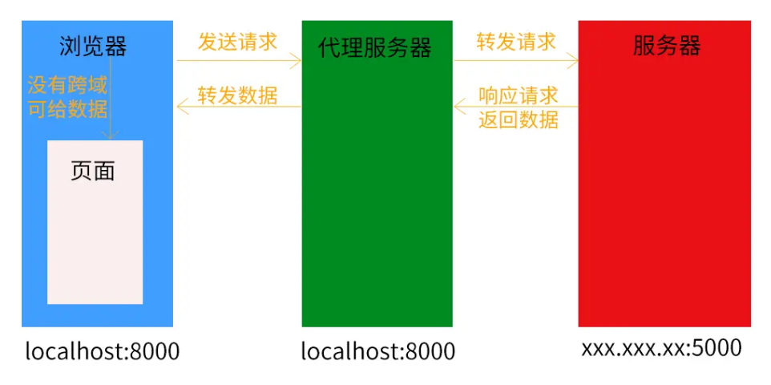

### Vue-Cli 代理服务器

<br>

- 当浏览器向服务器发起请求时，即使存在跨域问题，服务器依旧是会响应请求，并返回数据给浏览器，但当浏览器拿到数据后发现存在跨域问题了，这时候浏览器就不会将数据给页面，相当于把数据给扣留了
- 并不是说，发生跨域时请求根本就发不出去
- 代理服务器：与前端页面同源，返回的数据就不存在跨域的问题。代理服务器与服务器之间是非同源，但不存在跨域问题，**是因为服务器之间采用的是http请求，而不是ajax技术**
  
<br>




<br>

```javascript
// vue.config

// 代理服务器url，方式一
  devServer:{
    proxy:""
  }

// 方式二
  devServer:{
    proxy:{
      // 请求前缀
      '/api':{
        target:"http://localhost:xxx",
        pathRewrite:{'^/api':''},
        // websocket
        ws:true,
        changeOrigin:true

      }
    }
  }
```